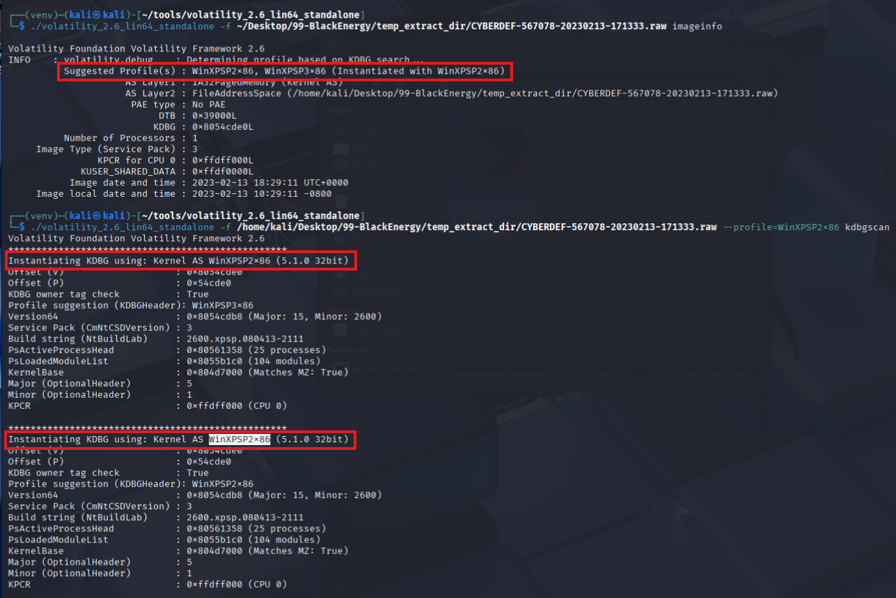
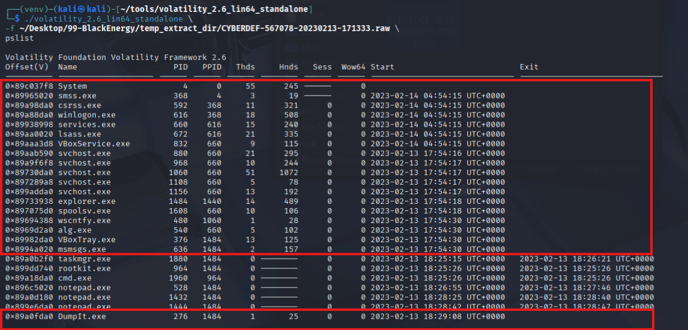
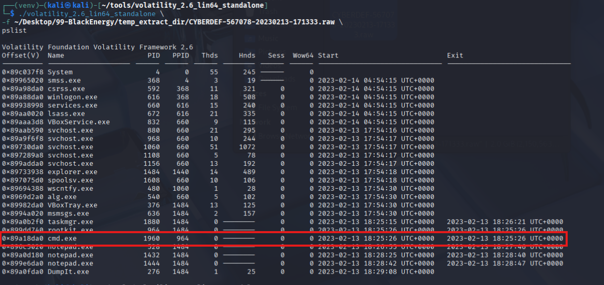
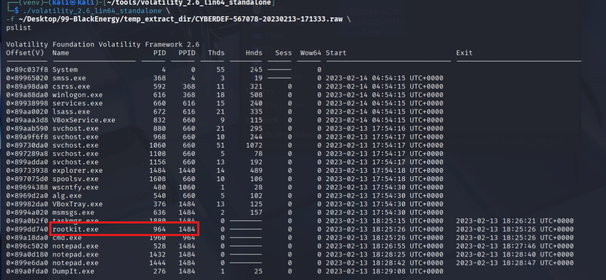
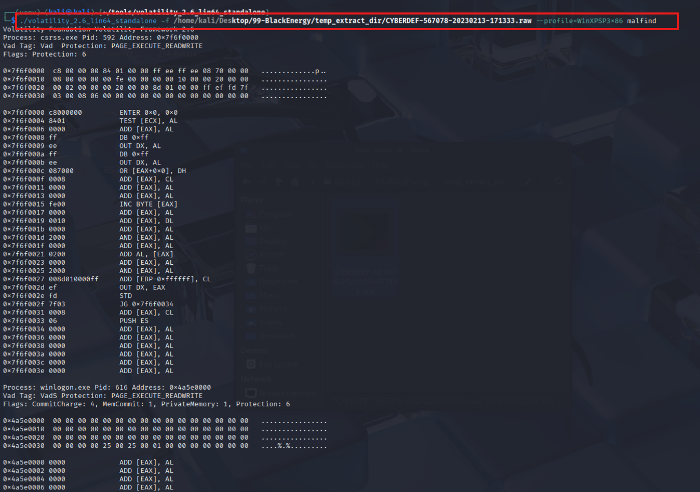
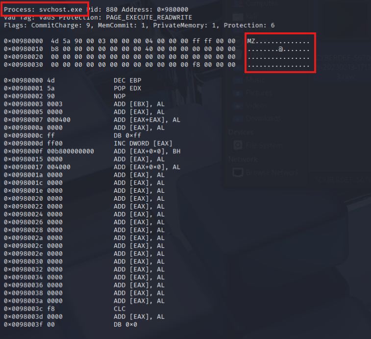
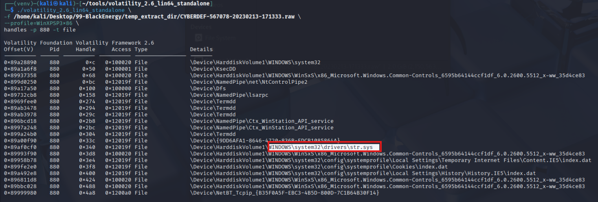
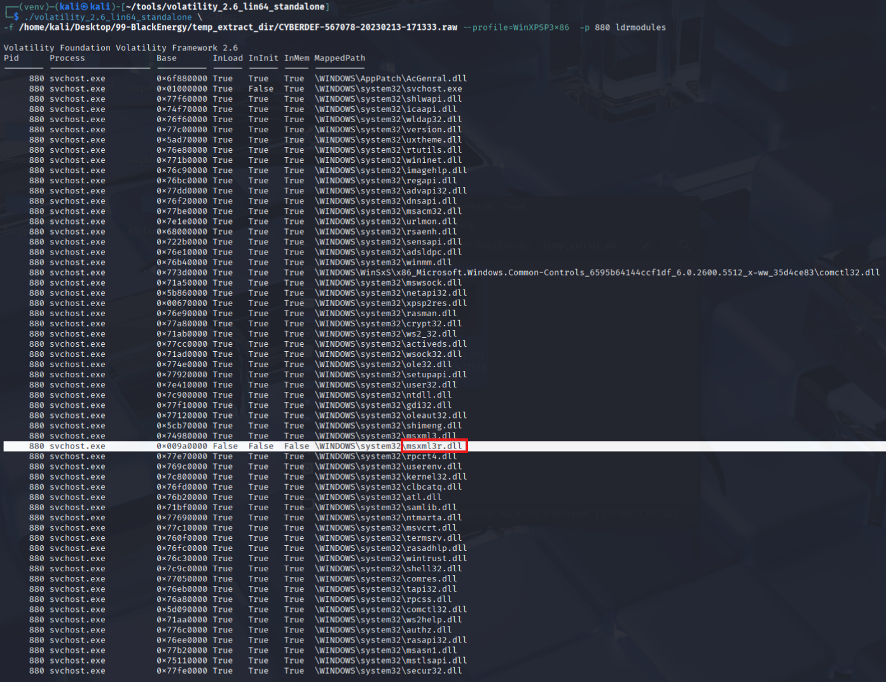
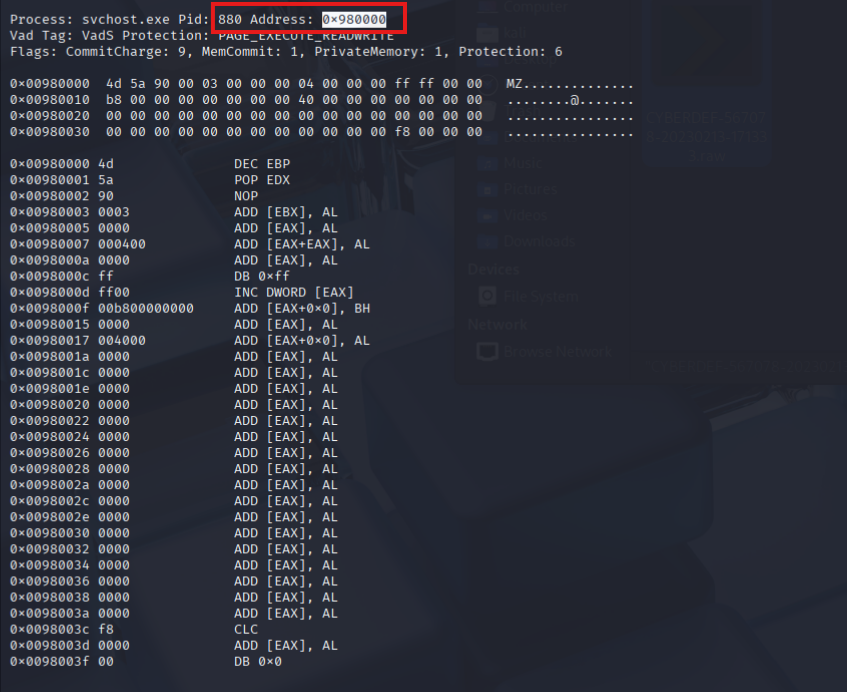

**I. Introduction**
- This lab delves into the forensic analysis of a Windows memory image to uncover indicators of compromise and malicious activity. By leveraging the powerful capabilities of the Volatility Framework, a widely used memory analysis tool, the walkthrough explores various techniques for investigating suspicious processes, identifying injected code, and examining anomalies in the operating system’s memory.

- The analysis begins with process enumeration to establish an overview of active and terminated processes within the captured memory. It then progresses to identifying potential malware behaviors, such as the presence of suspicious process names, code injection, and anomalous DLL loading. These findings are supported by detailed investigations into process handles, memory regions, and loaded modules, enabling a comprehensive understanding of how attackers exploit legitimate processes to evade detection.

- Key forensic techniques used in this walkthrough include the identification of injected** Portable Executable (PE)** files and the detection of abnormal memory permissions (e.g., **PAGE_EXECUTE_READWRITE**).

- The lab serves as a practical demonstration of how digital forensics tools can uncover advanced threats hidden within system memory. The analysis highlights the critical importance of memory forensics in modern cybersecurity investigations. The findings and methodologies outlined in this walkthrough are invaluable for professionals seeking to enhance their skills in malware analysis and incident response.

**II. Analysis**
**Q1: Which volatility profile would be best for this machine?**
- In this lab, we focus on analyzing a memory dump to investigate an attack carried out using the BlackEnergy malware. The first step in memory forensics using Volatility is determining the correct profile for the memory dump. Volatility profiles represent the operating system version and architecture associated with the memory dump. Selecting the correct profile is essential, as it ensures the framework can correctly interpret the structures within the memory.

- To begin, the imageinfo plugin is used to analyze the memory dump and identify potential profiles. The command executed is vol.exe -f <memory_dump_path> imageinfo, where the -f flag specifies the location of the memory dump. This plugin examines metadata within the dump, such as time stamps, kernel debugging information, and file signatures. Based on this analysis, Volatility suggests a set of profiles that may correspond to the system configuration of the compromised machine.
            
- Among the profiles suggested by the analysis, **WinXPSP2x86** (Windows XP Service Pack 2, 32-bit) appears as the most likely match. To confirm this, the kdbgscan plugin is employed. This plugin verifies the compatibility of the selected profile by scanning for Kernel Debugger Data Blocks (KDBG), critical kernel structures that can reveal details about the operating system. The command used for this verification is **vol.exe -f <memory_dump_path> --profile=WinXPSP2x86 kdbgscan**. The results show that the profile matches the memory dump, confirming its accuracy.

- Through this process, it is determined that the appropriate profile for this memory dump is **WinXPSP2x86**. This step is critical for the success of the investigation, as using an incorrect profile would result in incomplete or inaccurate analysis. With the correct profile identified, further forensic activities can now be conducted, including examining processes, network connections, and other system artifacts to understand the scope and impact of the attack. This foundational step ensures the integrity and reliability of subsequent analysis.
        Answer: **WinXPSP2x86**

**Q2: How many processes were running when the image was acquired?**
- To determine how many processes were actively running at the time the memory image was acquired, the pslist plugin of the Volatility Framework is used. This tool provides a detailed overview of processes present in the system memory, highlighting key information such as **process IDs (PIDs)**, **parent process IDs (PPIDs)**, and timestamps indicating when each process started and, if applicable, when it exited.

- The command executed specifies the memory image file to analyze and uses the --profile parameter to indicate the operating system profile, in this case, **WinXPSP2x86**, which corresponds to a Windows XP Service Pack 2 32-bit system. The -g option defines the **Kernel Debugger Data Block (KDBG)** address, which ensures that Volatility accurately interprets the memory structure. The **pslist** plugin then enumerates all processes present in the memory dump.

- The output of the pslist **plugin** lists all processes with detailed metadata, including start and exit times.
    
- To identify the number of processes that were running at the time of acquisition, we focus on processes with an empty or default exit timestamp (**0000-00-00 00:00:00 UTC+0000**). These entries indicate that the processes were active and had not yet terminated when the memory image was captured. By counting all such processes, while excluding those with valid exit times, we arrive at the total number of active processes.
- In the given analysis, a careful review of the process list reveals the running processes. For each row in the output where the exit time is absent or default, the process is considered active. Summing these rows gives the total count of running processes, which is **19**.

    Answer:**19**

**Q3: What is the process ID of cmd.exe?**
- To identify the process ID (PID) of **cmd.exe** within the memory image, the **pslist** plugin from Volatility Framework was utilized.
    

- In the provided output of the **pslist** plugin, each process is listed by its name in the Name column. To locate **cmd.exe**, we scan through the output and identify the row associated with this process. In the same row, the PID column specifies the process ID for **cmd.exe**. This is the unique identifier assigned to the process by the operating system during its execution.
- From the data shown, **cmd.exe** is listed with a process ID of **1960**. This means that during the time of memory acquisition, the instance of **cmd.exe** was identified by this PID, allowing analysts to track its activities further or analyze its behavior in the context of the investigation.

    Answer: **1960**

**Q4: What is the name of the most suspicious process?**
- Among the processes listed by the pslist plugin, one particularly stands out as suspicious due to its name: **rootkit.exe**.
    

- **Rootkits** are a class of malicious software designed to provide unauthorized access to a system while actively hiding their presence. They often operate at a low level within the operating system, allowing attackers to gain control of critical system processes and conceal malicious activities from both users and security tools. Their primary goal is to remain undetected while enabling persistent access or control over the compromised system.

- In this case, the **rootkit.exe** process is identified with a PID of **964** and a PPID of **1484**. The process exhibits an immediate exit timestamp, which is consistent with how some malware attempts to quickly execute and terminate to avoid detection. The name **rootkit.exe** alone raises a red flag, as legitimate system processes do not use such a naming convention. Coupled with its suspicious execution behavior, this process is likely a key target for further investigation to understand its origin, purpose, and impact on the system.
- Analyzing a process like **rootkit.exe** often involves examining its memory footprint, open handles, associated threads, and any disk artifacts it may have left behind. By identifying and understanding this process, we can determine whether it is part of a larger attack, such as a targeted intrusion or malware campaign, and take appropriate action to mitigate its impact.
        Answer: **rootkit.exe**

**Q5: Which process shows the highest likelihood of code injection?**

- To identify the process with the highest likelihood of code injection, the malfind plugin of the Volatility Framework is used. This plugin is specifically designed to detect memory regions within a process that may have been modified in a way indicative of malicious activity. Code injection refers to the act of inserting malicious code into the memory space of a legitimate process. This is a common technique used by malware to disguise its activity and bypass security mechanisms.
    

- The **malfind** plugin scans for memory regions within processes that have the characteristics of being both writable and executable, which is unusual under normal circumstances and often a sign of injected code. It also identifies anomalous memory segments that are not backed by legitimate modules or loaded binaries. Such characteristics strongly suggest the presence of injected or malicious code.
- In the output of the plugin, several processes are analyzed for signs of code injection. Each section details a specific process by name and its associated PID. For instance, processes like csrss.exe and winlogon.exe are evaluated with their respective memory regions and protections noted. However, upon analyzing the output, the **svchost.exe** process stands out as a likely candidate for code injection.
    

- The **svchost.exe** process with PID 880 demonstrates clear signs of code injection, and one of the most significant indicators is the presence of the **4D 5A** hexadecimal sequence within its memory. This sequence corresponds to the ASCII characters **MZ**, which is the magic number for Windows **Por table Executable (PE)** files. When this sequence is found in memory regions not typically associated with legitimate executable files, it strongly suggests malicious injection.

- The ****MZ header** is the starting signature of **PE** files, indicating the beginning of an executable or DLL. When such a header is found in an unexpected memory region, especially within a process like **svchost.exe**, it signifies that an attacker has likely injected a new PE file into the process. This method allows attackers to run malicious code under the guise of a legitimate process, thereby evading detection by traditional antivirus software or behavioral monitoring tools. The discovery of **MZ** in this context is a strong indicator that a new PE file has been injected into the memory of **svchost.exe**. This injection method enables attackers to load and execute malicious code seamlessly within a trusted system process.

- This combination is uncommon for legitimate processes but typical for injected code. The detection of injected code in a process like svchost.exe is especially concerning because this process is a legitimate Windows system service that is often targeted by attackers due to its high privileges and frequent operation. The presence of injected code within such a process suggests that an attacker is leveraging it for malicious purposes, such as maintaining persistence, executing arbitrary commands, or stealing sensitive information.
    Answer:**svchost.exe**

**Q6: There is an odd file referenced in the recent process. Provide the full path of that file.**
- To identify an odd file associated with a specific process, the handles plugin of the Volatility Framework is used. This plugin enumerates all open handles of a given process or all processes, showing references to system resources such as files, registry keys, events, and threads. These handles provide valuable insights into the resources a process interacts with during its operation, which can reveal anomalies or suspicious activity.
- The analysis focuses on the suspicious svchosts.exe process identified earlier, which is passed to the plugin using the **-p** option. By narrowing the analysis to this single process, only the handles relevant to it are displayed, allowing for a focused investigation of its behavior.
- Upon executing the handles plugin and reviewing its output, a suspicious file handle is identified.
            

- The process with PID 880 references the file:
**\Device\HarddiskVolume1\WINDOWS\system32\drivers\str.sys**
- This file is located within the system32\drivers directory, a common location for legitimate system drivers. However, the file name, str.sys, stands out as unusual, as it does not conform to standard naming conventions for system driver files. Malicious actors often plant files in this directory to achieve kernel-level access or persistence. Driver files like this are commonly associated with advanced threats such as rootkits, which use such files to hide their activities, intercept system calls, or control processes and network traffic.
    Answer:**Device\HarddiskVolume1\WINDOWS\system32\drivers\str.sys**

**Q7: What is the name of the injected dll file loaded from the recent process?**
- To identify the injected DLL file loaded into the process, the ldrmodules plugin of the Volatility Framework is used. This plugin examines the loaded modules (DLLs) within a specific process and categorizes them into three key lists: InLoad, InInit, and InMem. These lists correspond to whether a DLL is visible in the process’s load list, initialization list, or memory mapping. Injected DLLs often bypass normal loading mechanisms, making them invisible in one or more of these categories. Such behavior strongly suggests tampering or injection, as legitimate DLLs should typically appear in all three lists.
- The command specifies the memory image to analyze, the operating system profile for accurate memory parsing, and the specific process PID 880 to focus the analysis. By targeting this process, the command ensures that only the DLLs loaded by the specified process, in this case svchost.exe, are evaluated. The output reveals detailed information about each module, including its base address and mapped path, along with whether it is present in the expected lists.
            
- In the results, a notable anomaly is observed: the DLL file **msxml3r.dll** is loaded by **svchost.exe** but is marked as False in the InLoad, InInit, and InMem columns. This is highly suspicious because legitimate DLLs should be properly registered in all these categories. The fact that this DLL is not fully recognized in these lists indicates it has been injected into the process. DLL injection is a common technique used by attackers to execute malicious code within the context of a legitimate process. By doing so, they can hide their activities and exploit the privileges of the targeted process.
    Answer: **msxml3r.dll**

**Q8: What is the base address of the injected dll?**
- The output of the malfind plugin shows a memory region with suspicious characteristics. The malfind plugin highlights a memory section starting at the base address **0x980000**.
            

- This address represents the location in memory where the injected module resides. The presence of the **MZ header** (**4D 5A** in hexadecimal) at this address strongly indicates that the memory region contains a **Portable Executable (PE) **file, such as a DLL or executable.

    Answer: **0x980000**

