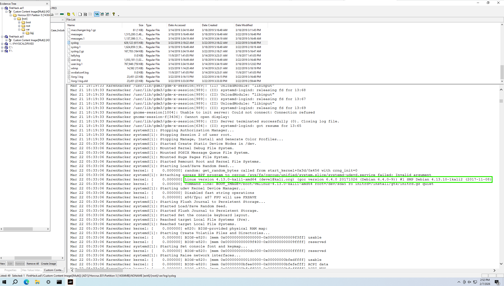
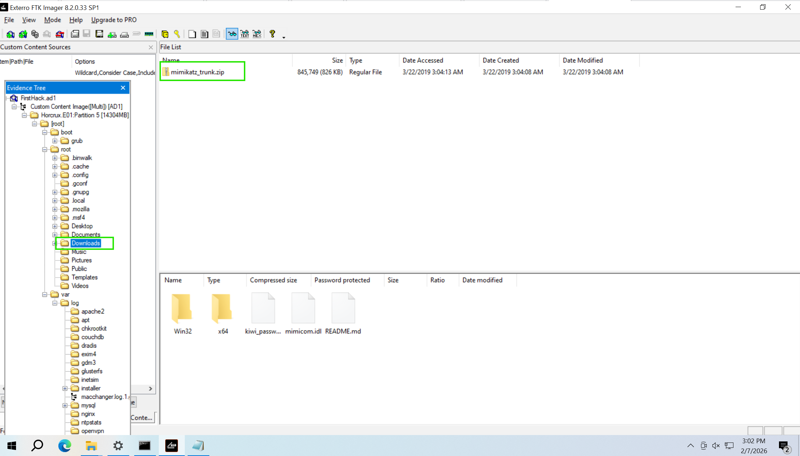
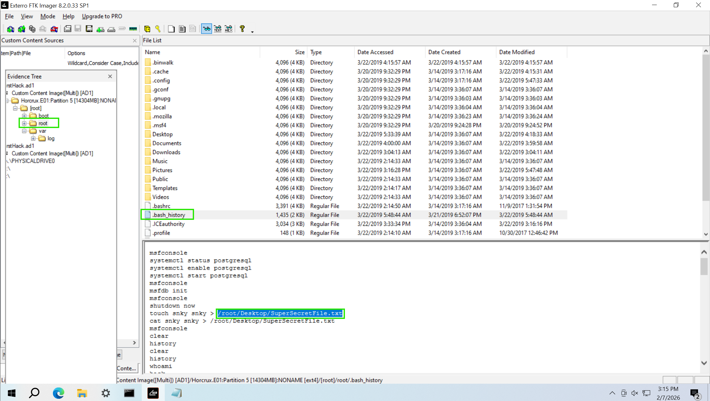
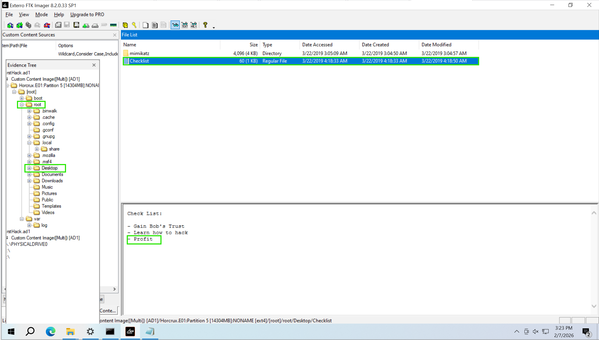
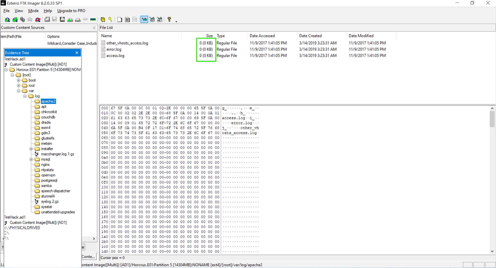
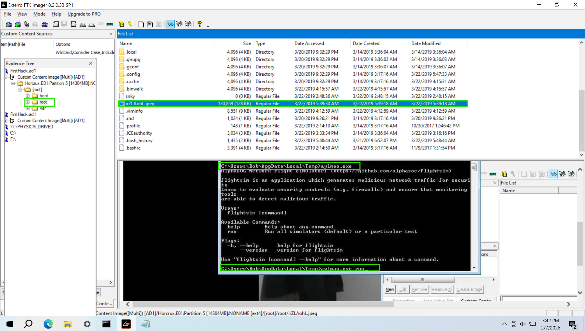
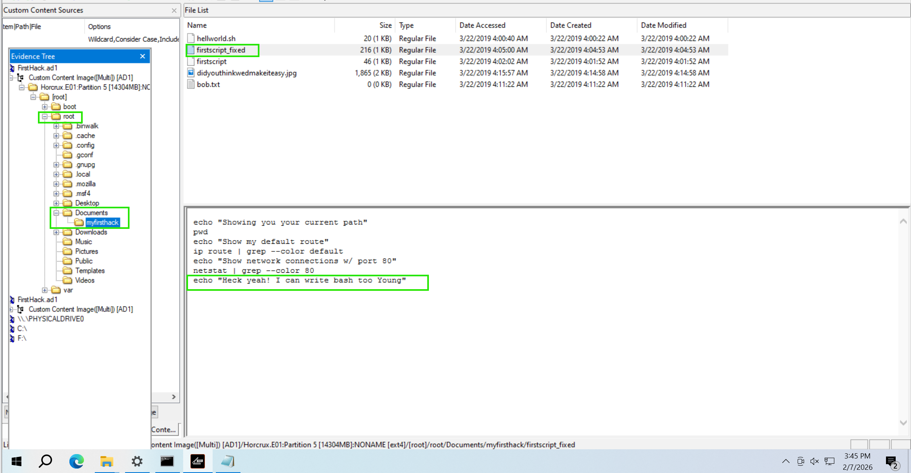
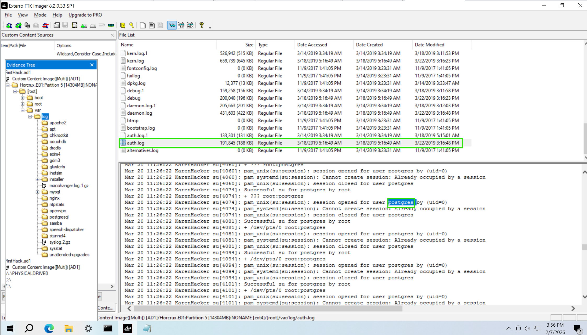
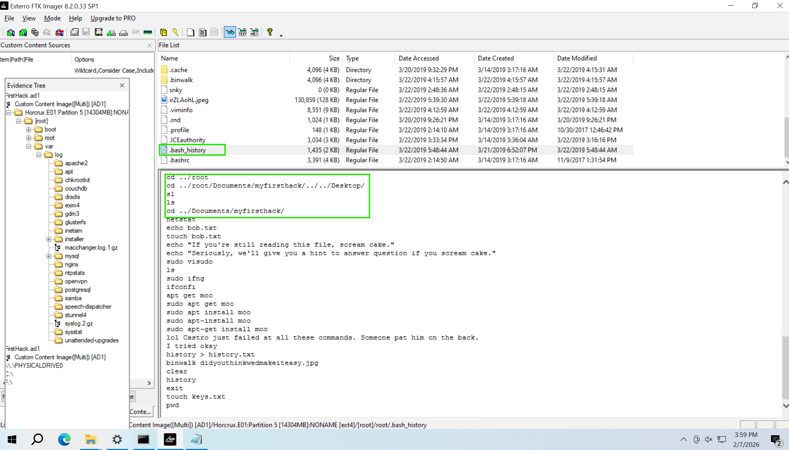

**I. Introduction**
- In this lab, you will take on the role of a Security Operations Center (SOC) analyst tasked with investigating suspicious activities conducted by an employee named Karen. Karen is suspected of engaging in unauthorized and potentially illegal actions within her organization, TAAUSAI. The investigation is based on a forensic disk image of Karen’s Linux-based workstation, which is analyzed to uncover evidence of malicious activity.

- The walkthrough demonstrates how to investigate insider threats by examining system logs, Bash history, downloaded files, and artifacts using FTK Imager. It highlights practical techniques for analyzing file integrity, identifying privilege escalation, and uncovering potential attacks. By the end of this lab, you will gain insights into endpoint forensics, log analysis, and the importance of monitoring insider threats to secure organizational systems.

**II. Analysis**
**Q1: What distribution of Linux is being used on this machine?**
- To determine the Linux distribution being used on this machine, we begin by examining the file system captured in the disk image using FTK Imager. After loading the disk image, we navigate through the directory structure to locate logs or configuration files that can reveal system information. A good starting point is the /var/log/ directory, which often contains logs related to system activities and installation details.
    
- In this case, we focus on the syslog file found in the /var/log/installer/ directory. Opening this file reveals detailed logs, including kernel initialization messages and boot parameters. Logs of this nature frequently provide information about the operating system version and distribution, as the kernel version and build metadata are logged during system startup.
- Within the syslog, we find a line indicating the Linux kernel version being used:
**Linux version 4.13.0-kali1-amd64 (devel@kali.org) (gcc version 6.4.0 20170920 (Debian 6.4.0-7)) #1 SMP Debian 4.13.4-1kali1 (2017-11-08)**

- Analyzing this output, we identify that the operating system is Kali Linux, which is a Debian-based distribution designed for security testing and penetration testing purposes. The kernel version is 4.13.0-kali1-amd64, compiled using GCC version 6.4.0. The reference to kali.org confirms the distribution as Kali Linux.
- Kali Linux is a specialized distribution widely used by security professionals due to its extensive set of pre-installed tools for penetration testing, digital forensics, and security auditing. Its presence in this investigation hints at the possibility that the user may have utilized such tools to conduct unauthorized activities. Given this context, the operating system itself becomes a critical piece of evidence, potentially providing further leads as we continue analyzing logs and installed utilities.

    Answer: **Kali**

**Q2: What is the MD5 hash of the apache access.log**
- To determine the MD5 hash of the Apache **access.log** file, we first need to understand the concept of hashing. Hashing is a cryptographic process used to generate a fixed-length string, called a hash value, from input data of any size. This process is deterministic, meaning the same input will always produce the same hash. Hashing is commonly used to verify the integrity of files, ensuring that no changes have been made to the data. In digital forensics, hash values are critical for verifying the authenticity of evidence and identifying tampered or altered files.
- The Apache **access.log** file is an essential component of the Apache HTTP Server, which records all HTTP requests made to the server. It logs details such as the IP address of the client, timestamps, requested URLs, HTTP methods, response codes, and user-agent information. This log is vital for monitoring server activity, detecting malicious requests, and identifying potential security incidents. In forensic investigations, examining this log can reveal unauthorized access attempts or patterns indicating malicious behavior.
- **Using FTK Imager**, we can calculate the MD5 hash of files located in the disk image.We right-click on the **access.log** file, then select the Export File Hash List... option to extract the file's hash value.
        
- The hash value will be stored in the hash.csv file.
        
- This hash uniquely identifies the contents of the **access.log** file at the time it was analyzed. Any modification to this file would result in a completely different hash, making it easy to detect alterations.
- By leveraging FTK Imager’s hashing functionality, investigators can document and validate the integrity of files extracted from a disk image. This practice ensures that the evidence remains admissible in court and allows investigators to track any changes during the analysis process. The MD5 hash obtained here serves as a fingerprint for the **access.log** file, providing assurance that its contents have not been tampered with since acquisition.

    Answer: **d41d8cd98f00b204e9800998ecf8427e**

**Q3: It is suspected that a credential dumping tool was downloaded. What is the name of the downloaded file?**
- **Credential dumping** is a technique used by attackers to extract login credentials, such as usernames and passwords, from a compromised system. These credentials are often stored in memory, security databases, or cached locations by the operating system. Attackers leverage this method to escalate privileges, move laterally within a network, or gain unauthorized access to sensitive resources. Credential dumping is a significant security threat as it allows attackers to impersonate legitimate users, bypass authentication mechanisms, and further infiltrate systems without detection.
- By examining the disk image in FTK Imager, we navigate to the /root/Downloads/ directory, which commonly stores files downloaded by the user. Within this directory, we identify a file named mimikatz_trunk.zip.
        
- **Mimikatz** is a widely used post-exploitation tool designed to extract plaintext passwords, hashes, PINs, and Kerberos tickets from system memory. It can also perform pass-the-hash attacks, manipulate authentication tokens, and export certificates, making it a powerful tool for credential theft. Although **Mimikatz** is often used by penetration testers for legitimate security assessments, it is equally exploited by malicious actors to compromise systems and exfiltrate sensitive data.

- The discovery of the **mimikatz_trunk.zip** file suggests that this system likely harbored tools associated with credential theft. Its presence in the Downloads folder indicates that it was manually acquired, potentially as part of unauthorized or malicious activities. This finding supports the hypothesis that credential dumping tools were downloaded and potentially deployed.

    Answer: **mimikatz_trunk.zip**

**Q4: There was a super-secret file created. What is the absolute path?**
- To determine the absolute path of the super-secret file, we need to investigate user activity logs stored on the system. One of the most valuable artifacts for such analysis in Linux systems is the .bash_history file. This file is located in the home directory of each user and logs all commands executed in the terminal. It is particularly important in forensic investigations, as it provides a chronological record of commands that can reveal activities such as file creation, data manipulation, or attempts to cover tracks. For a root user, the .bash_history file holds even greater significance because commands executed under this account have administrative privileges and unrestricted access to the system.
- By analyzing the .bash_history file in the /root/ directory, we uncover several commands executed by the user. Among them, we find commands that specifically create and write to a file referred to as a "super-secret" file.
        

- The command:**touch snky snky > /root/Desktop/SuperSecretFile.txt** creates a file named SuperSecretFile.txt in the /root/Desktop/ directory. The touch command is commonly used to create empty files, but in this case, it is followed by redirection (>), which takes the contents of the snky file and writes it into the newly created SuperSecretFile.txt file.

Answer: **/root/Desktop/SuperSecretFile.txt**

**Q5: What program used didyouthinkwedmakeiteasy.jpg during execution?**
- To determine which program was used to execute the file **didyouthinkwedmakeiteasy.jpg**, we can examine the command history stored in the .**bash_history** file. This file logs the commands executed in the terminal, making it an invaluable resource for tracking user activity. By reviewing the command history, we can identify the tools or programs that interacted with specific files.
- An analysis of the .bash_history file reveals the following command:
    **binwalk didyouthinkwedmakeiteasy.jpg**
        

    Answer: **binwalk**

**Q6: What is the third goal from the checklist Karen created?**
- To uncover the third goal from the checklist Karen created, we analyze the directory structure and files found in the investigation. By navigating to the **/root/Desktop/** directory, we discover a file named Checklist. The contents of this file reveal a series of goals or tasks outlined by the user, providing insight into their intentions and actions.
        

    Answer: **Profit**

Q7: How many times was apache run?
- To determine how many times Apache was run, we examine the contents of the Apache log directory located in **/var/log/apache2/**.
        
- This directory typically contains log files that track access requests, errors, and other server activities. The primary files of interest include:
    1. access.log - This file records all HTTP requests made to the server, including details such as IP addresses, requested resources, HTTP methods, and timestamps. It is a key source for analyzing web traffic and identifying suspicious activities or unauthorized access attempts.

    2. error.log - This file logs errors encountered by the server, such as configuration issues, failed requests, and server crashes. It helps in diagnosing problems with the server configuration or identifying attempts to exploit vulnerabilities.

    3. other_vhosts_access.log - This file logs HTTP requests specific to virtual hosts configured on the server. Virtual hosts allow a single Apache instance to host multiple websites, each with its own configuration and logging requirements.
- In this case, an inspection of the logs reveals that all three files—access.log, error.log, and other_vhosts_access.log—have a size of 0 KB. This indicates that no data has been recorded in these logs, which strongly suggests that Apache was never run or accessed during the monitored period. The lack of entries could also imply that the logs were cleared, truncated, or manipulated to cover up activities. However, based solely on the current state of the logs, there is no evidence of Apache being started or handling any requests.

    Answer: **0**

**Q8: It is believed this machine was used to attack another. What file proves this?**
- To determine whether this machine was used to launch an attack against another system, we examine the evidence provided in the investigation. By navigating through the directory structure, we discover a file named **irZLAohL.jpeg** stored in the **/root/** directory.
            
- Further evidence reveals a terminal window displaying the execution of a program named flightSim located in the **C:\Users\Bob\AppData\Local\Temp** directory. FlightSim, as shown in the terminal output, is a tool used for generating malicious network traffic to simulate attacks. Its primary purpose is to evaluate the effectiveness of security monitoring systems, such as firewalls and intrusion detection systems, by testing their ability to detect simulated threats. The command **flightSim.exe** run seen in the output is used to initiate these attack simulations, which can include scenarios like port scans, brute-force attacks, and DNS tunneling attempts.
- The presence of flightSim.exe and its execution in the terminal window strongly suggests that this machine was configured to simulate or execute attacks against other systems. While FlightSim is designed for legitimate security testing, its use in this context raises concerns about whether it was deployed maliciously. Coupled with the presence of the suspicious **irZLAohL.jpeg** file the evidence points to potential offensive activity originating from this machine.

    Answer: **irZLAohL.jpeg**

**Q9: Within the Documents file path, it is believed that Karen was taunting a fellow computer expert through a bash script. Who was Karen taunting?**
- To determine who Karen was taunting through a bash script, we analyze the contents of the Documents/myfirsthack directory, which contains a file named **firstscript_fixed**. This file is a shell script written in Bash, a common scripting language used for automating tasks and interacting with system commands.
- Upon examining the script, it includes a series of commands designed to display system information. The commands include:
    +  Showing the current working directory (**pwd**).

    +  Displaying the default network route using **ip route**.

    +  Listing network connections associated with **port 80** using **netstat**.
- Toward the end of the script, there is a line that stands out as a taunt:
    **echo "Heck yeah! I can write bash too Young"**

    

- This line explicitly references someone named Young and implies a boastful tone about Karen’s ability to write Bash scripts. It appears that Karen is taunting Young, possibly another computer expert or a peer, by demonstrating her scripting skills in a playful or competitive manner.
- This evidence suggests Karen may have been engaging in a rivalry or attempting to showcase her technical skills, potentially hinting at her mindset or motivations during the activities being investigated.

    Answer: **Young**

**Q10: A user su'd to root at 11:26 multiple times. Who was it?**
- To determine who switched to the root user (su'd) at **11:26** multiple times, we need to analyze the contents of the **auth.log** file located in the **/var/log/** directory. The auth.log file is a system log in Linux that records authentication-related events, such as user logins, privilege escalations, and SSH connections. It provides detailed logs of session activities, including successful and failed login attempts, use of the **sudo** and **su** commands, and any authentication errors.
- In this investigation, the a**uth.log** file reveals multiple entries indicating that a user escalated privileges using the su command at 11:26. Specifically, the logs show the following entry:
**Mar 20 11:26:22 KarenHacker su[4060]: Successful su for postgres by root**
    
- This entry confirms that the user identified as KarenHacker successfully switched to the postgres account using root privileges. The su command in Linux is used to switch users, often to elevate privileges temporarily. The repeated entries at 11:26:22 indicate multiple attempts, possibly suggesting either repeated testing, misconfiguration checks, or intentional privilege escalation.
- The logs also capture a sequence of sessions being opened and closed for the postgres user, highlighting that KarenHacker may have been interacting with database services or attempting to modify database configurations. Since the postgres account is typically associated with PostgreSQL database management, this activity could imply attempts to manipulate data, extract information, or configure unauthorized access.
    Answer: **postgres** 

**Q11:Based on the bash history, what is the current working directory?**
- To determine the current working directory based on the Bash history, we analyze the commands executed by the user as recorded in the .**bash_history** file. This file provides a chronological record of terminal commands, allowing us to trace the user’s navigation through the file system.
    
- From the commands listed, we observe the following sequence:
        **cd ../Documents/myfirsthack/**
- This command changes the directory to **../Documents/myfirsthack/**. The cd (change directory) command moves the user into the specified path relative to the current location. Here, .. indicates moving up one level in the directory hierarchy before navigating into the **Documents/myfirsthack/** folder.

- Given the sequence of commands, the user moved into the myfirsthack directory located inside the Documents folder under the **/root/** directory. This means the absolute path of the current working directory is **/root/Documents/myfirsthack/**.

    Answer: **/root/Documents/myfirsthack/**.
