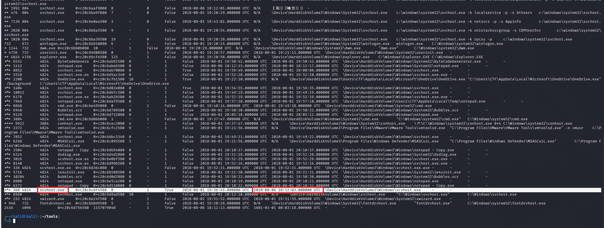
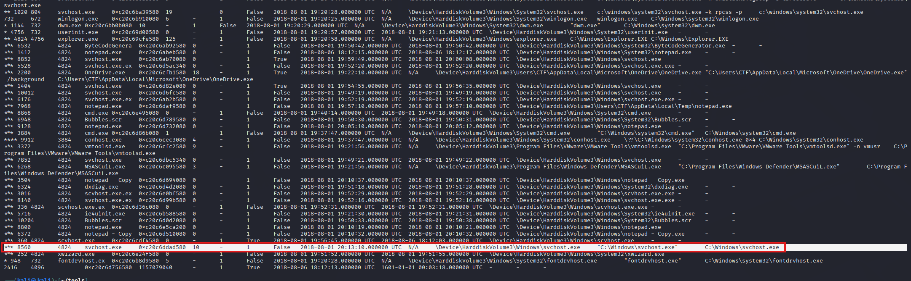
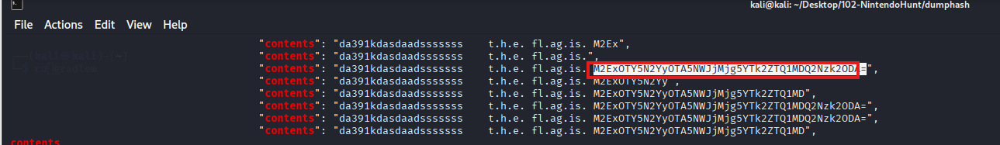
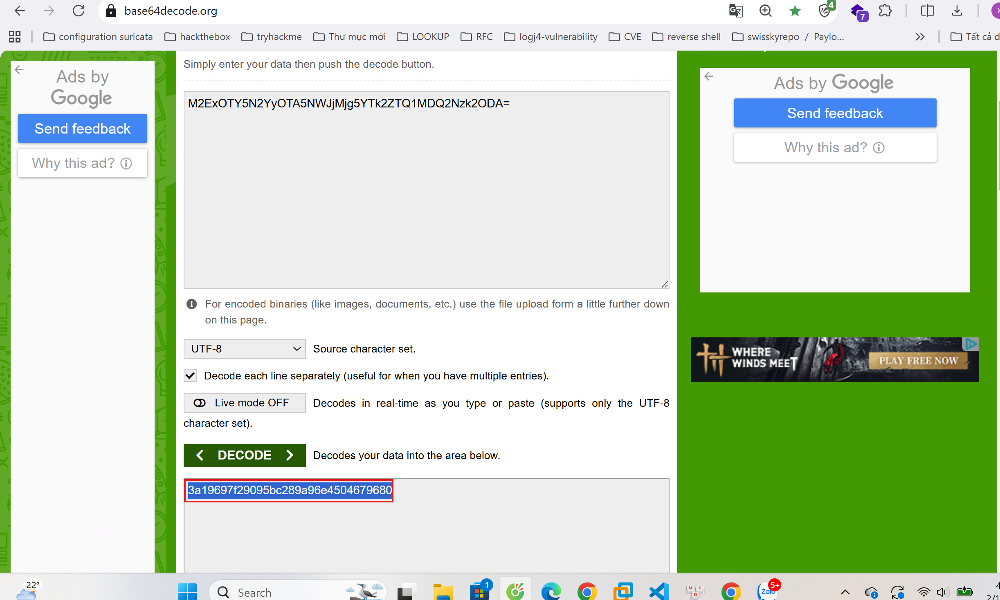
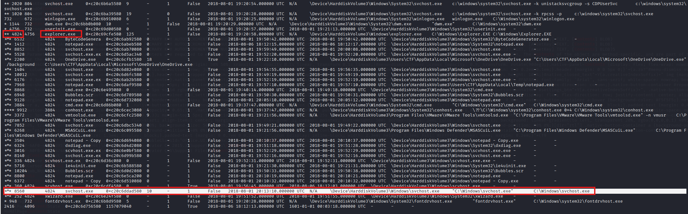
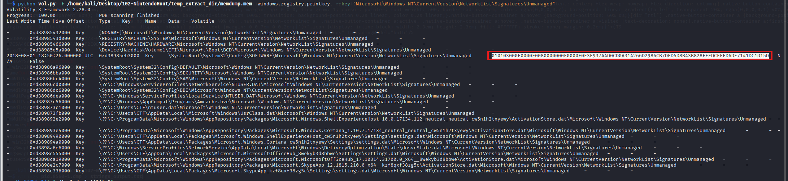
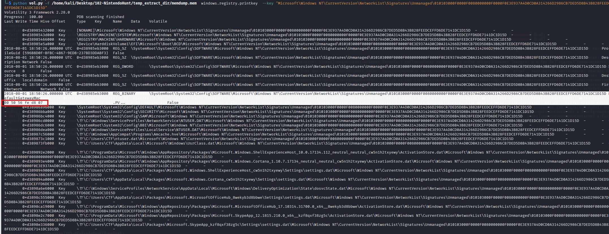
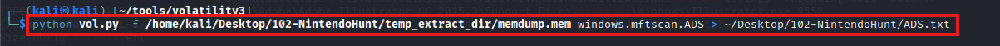
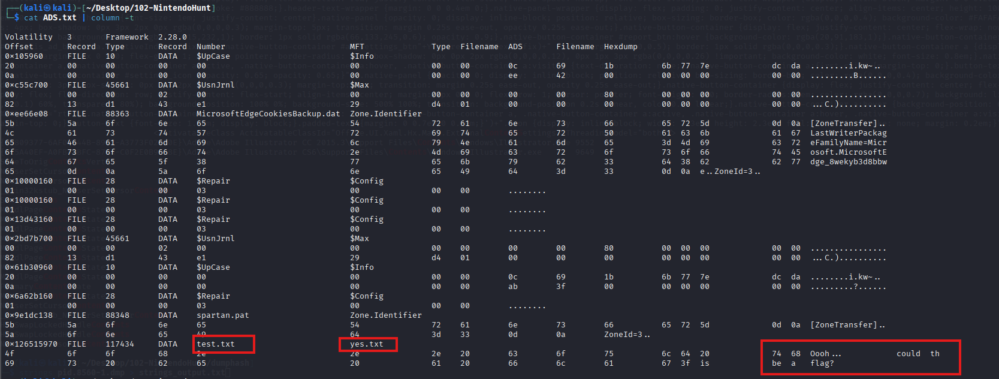

I. Introduction
-  Welcome to the NintendoHunt Lab walkthrough, where we'll explore a fascinating cybersecurity investigation scenario. As SOC Analysts, we're tasked with investigating a potential security breach at a company that has noticed unusual network activity on one of their computers. This walkthrough will guide you through the process of memory forensics using Volatility, a powerful memory analysis framework that allows us to examine the contents of RAM captures. Memory forensics is an essential discipline in modern cybersecurity investigations because it reveals evidence that might not be visible through traditional disk forensics. When malware runs on a system, it must exist in memory to execute, making memory analysis crucial for detecting sophisticated threats that might not leave traces on disk. In this lab, we'll work with a memory dump from a potentially compromised Windows system and follow a methodical approach to identify malicious processes, extract hidden data, and understand the attacker's techniques. We'll apply various Volatility plugins to analyze process hierarchies, extract process memory, examine registry artifacts, and explore file system evidence that might reveal the nature of the compromise.
-  Throughout this walkthrough, we'll cover important concepts in endpoint forensics, including process relationships, memory extraction, registry analysis, and detection of stealth techniques like Alternative Data Streams. We'll also look at browser artifacts to establish a timeline of user activities that might be relevant to the investigation. The techniques demonstrated in this lab represent real-world approaches used by security professionals to investigate breaches and understand attacker methodologies. The lab will challenge you to think like both an attacker and a defender, understanding how malicious code might attempt to hide its presence and how forensic tools can uncover those attempts.
-  Let's begin our investigation into this suspicious activity and uncover what might be happening on this potentially compromised system.

**II. Analysis**

**Q1: What is the process ID of the currently running malicious process?**
- When investigating potential security breaches as SOC Analysts, memory forensics becomes an invaluable approach for identifying malicious processes running on a system. In this walkthrough, we will analyze a memory dump using Volatility 3, a powerful open-source memory forensics framework that allows us to extract digital artifacts from volatile memory (RAM) samples. Memory forensics is particularly useful because it can reveal evidence of malicious activities that might not be visible through traditional disk forensics, such as processes running only in memory, network connections, and injected code. To identify the process ID of the currently running malicious process, we need to examine the process tree structure in the memory dump. The process tree visually represents the parent-child relationships between processes, which helps us understand how processes were spawned and potentially identify anomalous process creations. In a Windows environment, certain process relationships are expected and deviations from these normal patterns often indicate suspicious activity. Looking at the output of the Volatility **windows.pstree** plugin from the provided memory dump, we can observe numerous running processes.
    
- The pstree plugin displays processes hierarchically, showing parent-child relationships that help us identify which process spawned another. Each line in the output contains important information such as process identifiers (PIDs), process names, and their hierarchical relationships. This hierarchical view is crucial as malware often tries to hide by masquerading as legitimate processes or by being spawned from legitimate parent processes. Upon examining the memory dump output, we can see that the **explorer.exe** process (with PID **4824**) has spawned multiple child processes. This is an important observation because **explorer.exe** is the Windows shell that provides the desktop environment and is frequently targeted by attackers as a parent process to launch their malicious code. Among these child processes, we notice several instances of **svchost.exe**, which is a legitimate Windows process that hosts multiple Windows services. This is suspicious since a **svchost.exe** is under normal circumstances a child of the services.exe process, making these instances suspicious. The only active **svchost.exe** process, at the time of the capture, is the process with pid **8560**.
    
    Answer: **8560**

**Q2: What is the md5 hash hidden in the malicious process memory?**

- After identifying the suspicious process with PID 8560, our next step is to extract and analyze its memory content to find any hidden data, such as **MD5** hashes. To achieve this, we use the Volatility windows.memmap plugin to dump the memory associated with this process. The windows.memmap plugin is designed to extract the virtual address space of a specific process, allowing us to perform deeper analysis on the extracted data. Once we have dumped the process memory, we can analyze its content using the strings utility, which extracts printable character sequences from binary files. This technique is particularly useful for identifying embedded text, commands, URLs, and other valuable indicators within the binary data. The strings utility works by scanning through the binary data and identifying sequences of characters that are printable in the ASCII or Unicode character sets, effectively filtering out the non-readable binary data and presenting text that might provide clues about the malware's functionality.
    

- When examining the output from the strings command on the dumped memory, we come across an interesting JSON structure containing what appears to be encoded data. Within this structure, we identify a field labeled contents that contains an string with the word flag in it. The encoded string appears to be using **Base64** encoding, which is a common technique used to obfuscate data and evade detection. **Base64** encoding converts binary data into a text format using a set of 64 characters that are both printable and common across many character encodings. This makes it ideal for transmitting binary data over channels that only reliably support text content, but also serves as a simple obfuscation technique for hiding malicious content from basic security scanning. To decode this **Base64** string, we utilize CyberChef, a web-based application that provides various data encoding and decoding capabilities. CyberChef offers a user-friendly interface where we can input our encoded data and apply various operations, such as Base64 decoding, to reveal the original content.
    
- When the Base64 string is decoded, it reveals a hexadecimal string: **3a19697f29095bc289a96e4504679680**. This 32-character hexadecimal string matches the format of an **MD5** hash, which is a cryptographic hash function that produces a 128-bit (16-byte) hash value, typically expressed as a 32-digit hexadecimal number.
    Answer: **3a19697f29095bc289a96e4504679680**

**Q3: What is the process name of the malicious process parent?**
- We have already seen in our analysis in **Q1**, the malicious svchost.exe process with PID **8560** was a child of the **explorer.exe** process with a PID **4824**.
    
    Answer: **explorer.exe**

**Q4: What is the MAC address of this machine's default gateway?**
 - As we continue investigating the potential security breach, our next objective is to determine the MAC address of the system’s default gateway. Identifying this address is important in network forensics because it helps us understand the surrounding network infrastructure and can assist in detecting unauthorized devices or tracing lateral movement.

- To retrieve this information from the memory dump, we use Volatility 3’s windows.registry.printkey plugin to examine relevant Windows Registry artifacts. The Windows Registry stores detailed network configuration data, including information about previously connected networks.
- We begin by enumerating the following Registry path:**Microsoft\Windows NT\CurrentVersion\NetworkList\Signatures\Unmanaged**
- This key contains subdirectories representing individual network signatures. Each subdirectory corresponds to a specific network the system has connected to and is identified by a long hexadecimal string.
- The output below shows the enumeration of the Unmanaged key:
        
- From this output, we observe a subkey with a long hexadecimal identifier (highlighted in the image). This identifier represents a specific network signature entry. In order to examine the detailed properties of this network connection, we must query this subdirectory directly.
- We then execute the plugin again, this time appending the identified subkey to the Registry path:
**Microsoft\Windows NT\CurrentVersion\NetworkList\Signatures\Unmanaged\<NetworkSignatureID>**
        

- After inspecting this specific subkey, we observe several registry values associated with the network connection. Among them, we identify an important entry labeled **DefaultGatewayMac**.
- The following image highlights the relevant registry value:
The DefaultGatewayMac value contains the MAC address of the system’s default gateway — typically the router connecting the local machine to other networks or the internet.
- The extracted hexadecimal value is:
        **00 50 56 fe d8 07**
- Formatted in standard notation, the MAC address is: **00:50:56:fe:d8:07**
- MAC addresses consist of six pairs of hexadecimal digits. The first three bytes (Organizationally Unique Identifier – OUI) identify the manufacturer, while the remaining three bytes uniquely identify the specific network interface.
- Therefore, the MAC address of this machine’s default gateway is: **00:50:56:fe:d8:07**
- This registry artifact confirms the physical hardware identifier of the gateway device associated with the network connection at the time the memory image was captured.
    Answer: **00:50:56:FE:D8:07**

**Q5: What is the name of the file that is hidden in the alternative data stream?**
- As we continue investigating the potentially compromised system, we shift our focus to another stealth technique frequently used by attackers: **Alternative Data Streams (ADS)**.
- ADS is a feature of the NTFS file system that allows a file to contain multiple data streams. Normally, users only see the primary data stream of a file. However, additional streams can be attached to a file without being visible in Windows Explorer or through standard file listing commands. Because of this behavior, attackers often use ADS to hide malicious payloads inside seemingly legitimate files.
- When malware leverages ADS, the visible file appears completely benign, while the malicious content is stored in a hidden stream attached to it. This makes ADS an effective persistence and evasion mechanism, especially against basic security monitoring tools.
- **Step 1: Scanning for Alternative Data Streams**
    +  To identify files using **ADS** within the memory image, we use Volatility 3’s **windows.mftscan.ADS** plugin, which scans the **Master File Table (MFT)** for entries containing alternative data streams.
    + The command executed is shown below:
            
- **Step 2: Analyzing the ADS Scan Results**
    +  Next, we examine the contents of the output file: **cat ADS.txt | column -t**
            

    + The formatted results reveal several files and their associated **ADS** entries.
    + While reviewing the output, we observe an entry where:
        The main file is **test.txt**
        The associated **Alternative Data Stream** is named **yes.txt**
    -> The presence of yes.txt in the **ADS** column indicates that this stream is hidden within the primary file **test.txt**.
    +  Additionally, the hex and ASCII preview on the right-hand side shows suspicious embedded content (e.g., readable strings such as “could this be a flag?”), confirming that the alternative stream contains meaningful data rather than being empty or benign metadata.
    +  This file exists as a hidden ADS attached to test.txt, making it invisible during normal file browsing but recoverable through forensic analysis of the MFT.
     Answer: **yes.txt**