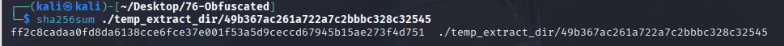
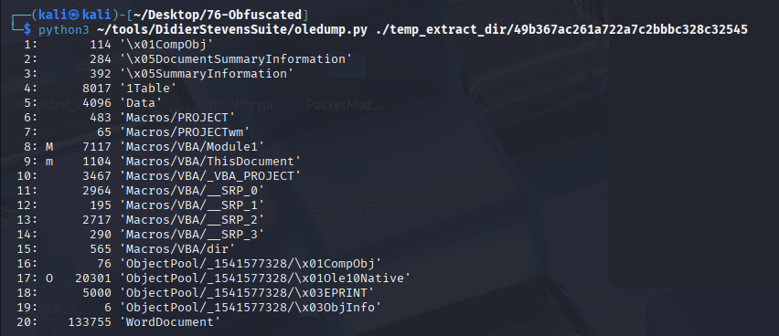
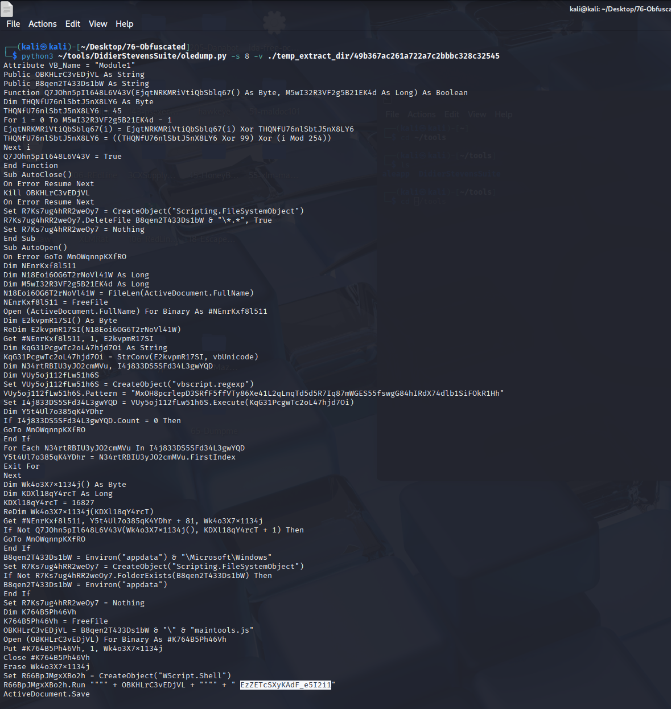
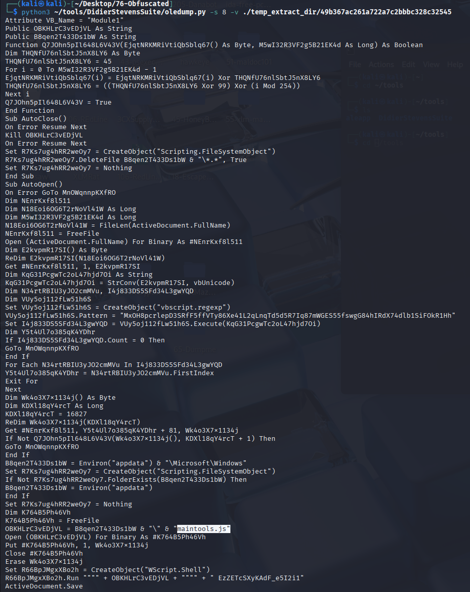

I. Scenario
- While working as a SOC analyst, you may encounter alerts from the enterprise Endpoint Detection and Response (EDR) system regarding unusual activity on an end-user machine. In one instance, a user reported receiving an email containing a DOC file from an unknown sender. The user subsequently submitted the document for analysis to ensure it does not pose a security risk.
1. What is the SHA256 hash of the DOC file?
- Use sha256sum tool or Get-FileHash to calculate SHA256 hash of the file.
    
    Answer:**ff2c8cadaa0fd8da6138cce6fce37e001f53a5d9ceccd67945b15ae273f4d751**

2. Multiple streams contain macros in this document. Provide the number of the lowest one.
- Have you checked the streams within the document to see which ones contain macros?
- Use the oledump tool by Didier Stevens to list the streams and identify which ones contain macros.
- Run the command oledump.py filename to list all the streams. Streams with macros will be marked with M or m. Identify the stream with the lowest number that contains one of these markers.

    
Answer: 8

3. What is the decryption key of the obfuscated code?
- To find the decryption key, you will need to analyze the macro code within the document.
- Use oledump to extract and decompress the macro code. Look for any code involving WScript.Run.
- After identifying the stream with the macro using oledump.py -s <stream_number> -v filename, decompress the macro. Examine the code for a WScript.Run command, as it typically contains the decryption key as the first argument.
    

Answer: **EzZETcSXyKAdF_e5I2i1**

4. What is the name of the dropped file?
- The document might drop a file when executed. How could you observe this behavior?
- Consider using a controlled environment like a virtual machine or an online sandbox to monitor the document’s behavior.
- Run the document in an environment like ANY.RUN and observe the files modification section for new files. Alternatively, review the script from Q3 for any references to the dropped file's name in the WScript.Run command.
        

Answer:**maintools.js**

5. This script uses what language?
- The script's file extension and syntax might give you clues about the programming language.
- Look for objects like WScript in the script, which are commonly associated with certain languages.
- The script uses a .js extension and references objects like WScript, indicating it is written in JScript, Microsoft's implementation of ECMAScript, similar to JavaScript.

Answer: **JScript**

