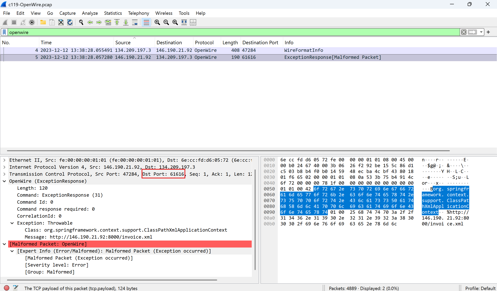
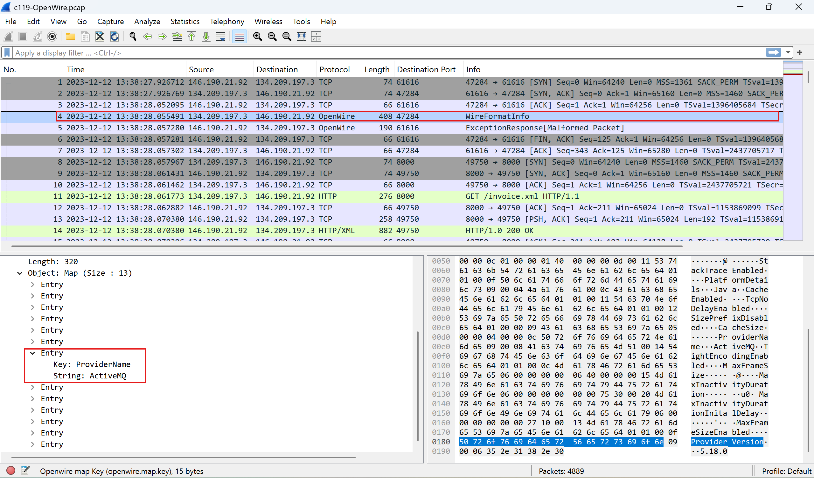
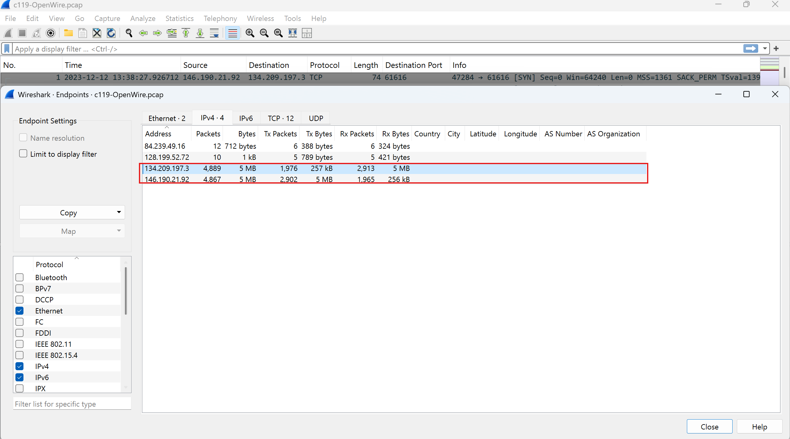
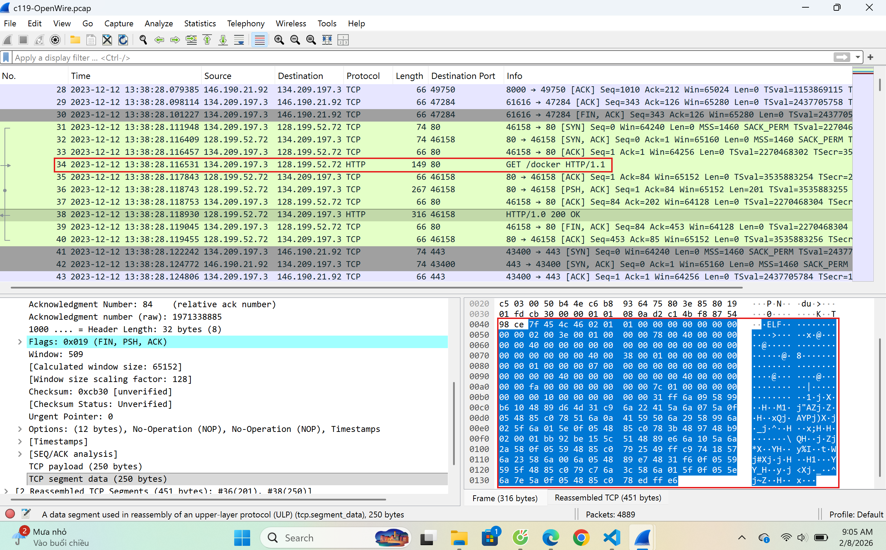
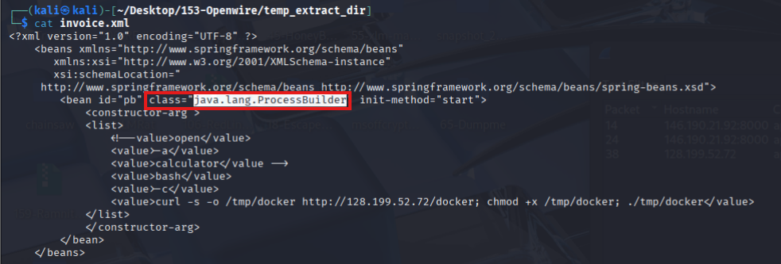
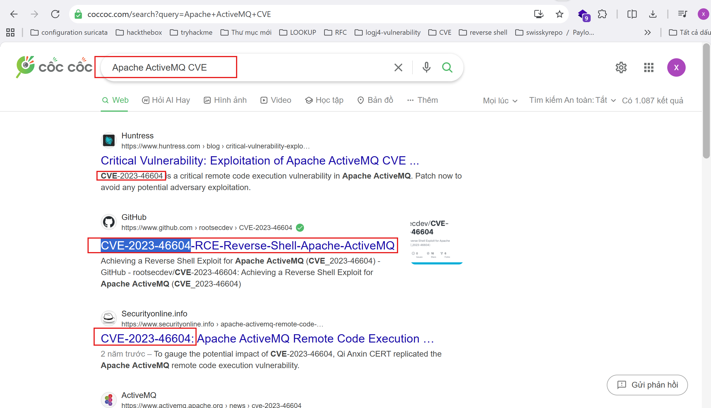
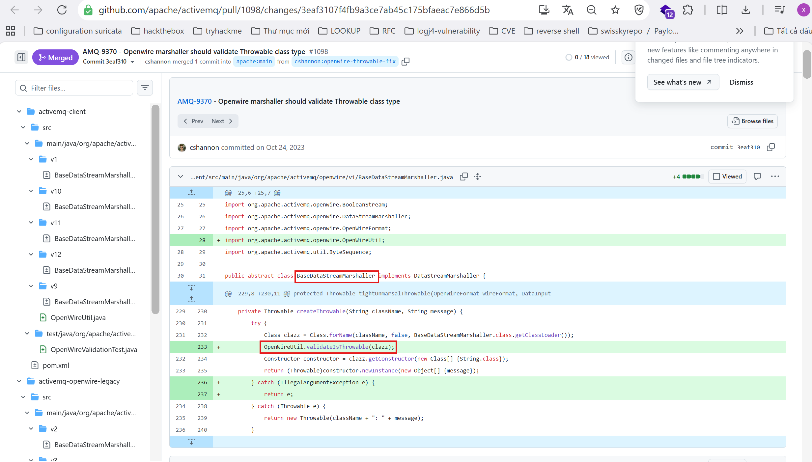

**I. Scenario**
During your shift as a tier-2 SOC analyst, you receive an escalation from a tier-1 analyst regarding a public-facing server. This server has been flagged for making outbound connections to multiple suspicious IPs. In response, you initiate the standard incident response protocol, which includes isolating the server from the network to prevent potential lateral movement or data exfiltration and obtaining a packet capture from the NSM utility for analysis. Your task is to analyze the pcap and assess for signs of malicious activity.

**Q1: By identifying the C2 IP, we can block traffic to and from this IP, helping to contain the breach and prevent further data exfiltration or command execution. Can you provide the IP of the C2 server that communicated with our server?**
  - Based on the basic description of the vulnerability, we understand that for the exploit to work, the attacker must have network access to a server running the vulnerable software—specifically, the public server in our case—in order to send the malicious OpenWire command to it.
  - From the packet capture, we can see that IP **146.190.21.92** was communicating with the service using OpenWire. Additionally, we can see the IP sending an OpenWire Exception Response command (**code 0x1F** ) which triggers the exploit to instantiate an object of the class **org.springframework.context.support.ClassPathXmlApplicationContext** to load a bean object defined by the XML at **http://146.190.21.92:8000/invoice.xml** 
    
    Answer: **146.190.21.92**

**Q2: Initial entry points are critical to trace the attack vector back. What is the port number of the service the adversary exploited?**
  - We can see from the capture that the Exception Response command was sent to the service running at port **61616** , which is the default port for the Apache ActiveMQ .
        
        Answer: **61616**

**Q3: Following up on the previous question, what is the name of the service found to be vulnerable?**
   - From the logs, it can be seen in the wire info response that the provider name is ActiveMQ which is a Message Oriented Middleware, MOM, that's part of the Apache suite.
        
        Answer: **Apache ActiveMQ**

**Q4: The attacker's infrastructure often involves multiple components. What is the IP of the second C2 server?**
   - To answer this question, we can go to the **statistics ➝ endpoints** to get a rough idea of the IPs present in the capture.
        

   - We already know that IPs **134.209.197.3** and **146.190.21.91** are the public server's and the attacker's **C&C** respectively. So we are left with 2 IPs: **84.239.46.16** and **128.199.52.72** .
    - By analyzing the traffic to and from each IP, we notice that the vulnerable server communicates with IP **128.199.52.72** to fetch the resource docker which seems to be shellcode.
        
        Answer: **128.199.52.72**

**Q5: Attackers usually leave traces on the disk. What is the name of the reverse shell executable dropped on the server?**
  - From the analysis performed in the previous step, it's clear that the resource docker is the reverse shell in question.
        Answer: **docker**

**Q6: What Java class was invoked by the XML file to run the exploit?**
   - To address this question, we need to analyze the HTTP response from the /invoice.xml endpoint.
        
        Answer: **java.lang.ProcessBuilder**

**Q7: To better understand the specific security flaw exploited, can you identify the CVE identifier associated with this vulnerability?**
            
            Answer: **CVE-2023-46604**

**Q8: The vendor addressed the vulnerability by adding a validation step to ensure that only valid Throwable classes can be instantiated, preventing exploitation. In which Java class and method was this validation step added?**
   - The patch for this vulnerability shows that an extra validation step was added to the class `BaseDataStreamMarshaller` to accurately verify if the class to instantiate is of a `Throwable` type, which fixes the vulnerability.
                
    Answer: **BaseDataStreamMarshaller.createThrowable**
