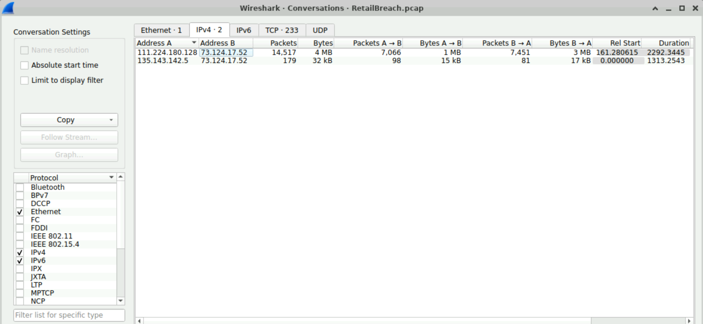
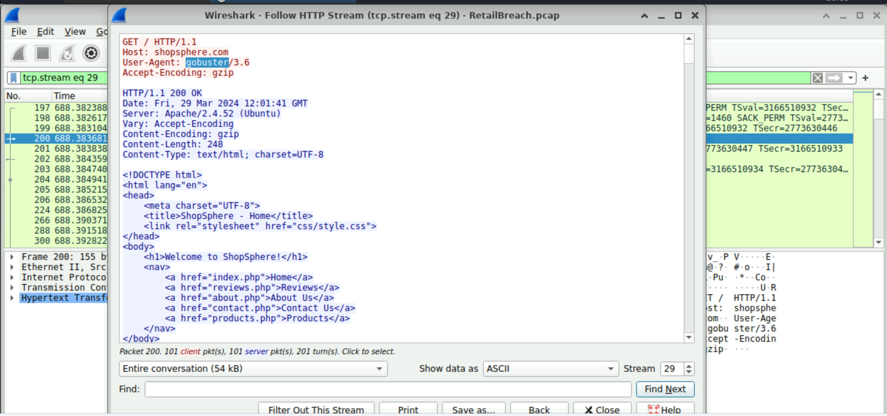
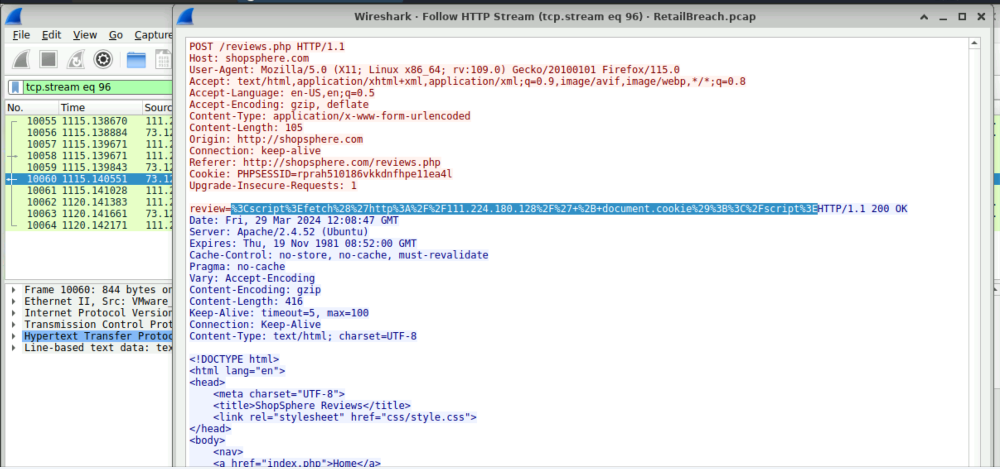
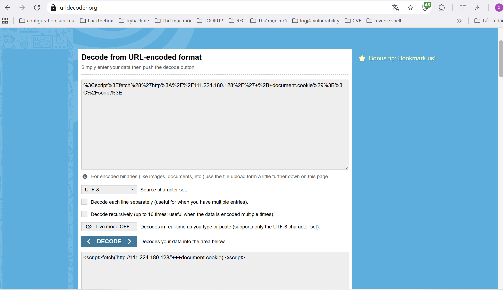
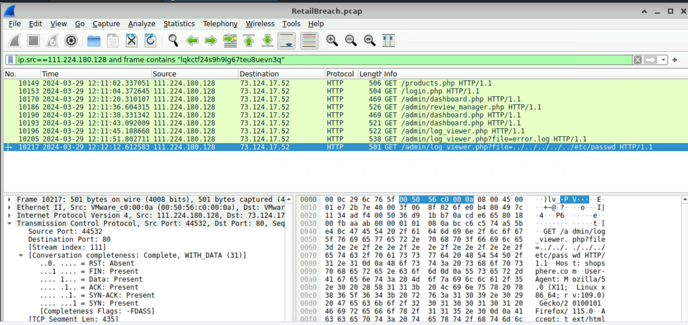

**RetailBreach Lab**

**I. Scenario**

- In recent days, ShopSphere, a prominent online retail platform, has experienced unusual administrative login activity during late-night hours. These logins coincide with an influx of customer complaints about unexplained account anomalies, raising concerns about a potential security breach. Initial observations suggest unauthorized access to administrative accounts, potentially indicating deeper system compromise.
- Your mission is to investigate the captured network traffic to determine the nature and source of the breach. Identifying how the attackers infiltrated the system and pinpointing their methods will be critical to understanding the attack's scope and mitigating its impact.

**II. Challenge**

**Q1: Identifying an attacker's IP address is crucial for mapping the attack's extent and planning an effective response. What is the attacker's IP address?**
-	Start by analyzing the list of IP addresses in the packet capture. Are there any unusual IPs that stand out as potentially malicious?
-	Use Wireshark's Statistics  Conversations to view all IPs involved. Look for suspicious communication between any two IPs, with one likely belonging to the Web Server.
-	Filter http traffic between the two IPs in Wireshark. The server **73.124.17.52** likely responds to the attacker's requests. Look for unusual interactions and identify the initiating IPs.

    

    Answer: **111.224.180.128**

**Q2 : The attacker used a directory brute-forcing tool to discover hidden paths. Which tool did the attacker use to perform the brute-forcing?**
-	Pay attention to the multiple **404 response codes** in the HTTP responses from the web server, and follow the HTTP stream to find the answer.
-	Apply the filter **http.response.code==404** to isolate 404 responses from the Web Server. Next, right-click on any **relevant packet > Follow > HTTP Stream** and look for the User-Agent header to determine the tool employed by the attacker.

    

    Answer: **gobuster**

**Q3: Cross-Site Scripting (XSS) allows attackers to inject malicious scripts into web pages viewed by users. Can you specify the XSS payload that the attacker used to compromise the integrity of the web application?**
-	Look for unusual HTTP requests from the attacker, focusing on signs of script injection, particularly the presence of the term 

**Q4: Pinpointing the exact moment an admin user encounters the injected malicious script is crucial for understanding the timeline of a security breach. Can you provide the UTC timestamp when the admin user first visited the page containing the injected malicious script?**
-	Focus on the traffic from the administrator’s IP address. Filter the packets for requests to **/reviews.php**.
-	Apply the filter **ip.src!=<attacker_IP> and http.request.uri contains "reviews.php"**. The timestamp of the packet will indicate when the admin visited the malicious page.

-	Review the two HTTP requests made by the admin to **/reviews.php**. The relevant request is the one after the page was infected. You can obtain the timestamp by examining the frame details in Wireshark. To view the Time, go to **View > Time Display Format > UTC Date and Time of Day**.

      
- Although in the image above, the results returned are 2 packets which are requests with the **GET** method to access the reviews.php file. But because the time the attacker started scanning in the previous question was **12:08**. Therefore, the time the attacker first accessed would be **12:09**.
    Answer: **2024-03-29 12:09**

**Q5: The theft of a session token through XSS is a serious security breach that allows unauthorized access. Can you provide the session token that the attacker acquired and used for this unauthorized access?**

-	The attacker’s JavaScript payload was designed to steal the session token. Check the HTTP request headers and cookies for any session-related information.
-	Filter for packets from the admin's IP and inspect the HTTP responses. Look for the session token in the HTTP headers or cookies that may have been stolen by the attacker.
-	Identify requests made by the admin's IP after the **/reviews.php** page was infected and follow the HTTP stream. Look for the session cookie or token in the HTTP request.
 
     

    Answer: **lqkctf24s9h9lg67teu8uevn3q**

**Q6: Identifying which scripts have been exploited is crucial for mitigating vulnerabilities in a web application. What is the name of the script that was exploited by the attacker?**
  -	The attacker likely exploited a script vulnerable to directory traversal. Look for HTTP requests with unusual parameters or behaviors, such as sequences like **../**, which can indicate an attempt to access files outside the intended directory.
  -	Filter HTTP requests made by the attacker that include the stolen session key you identified earlier. This will narrow down the packets to those directly associated with the attack.
  -	Use the following filter to isolate packets from the attacker: **ip.src == <attacker_IP>** and http and **frame contains "<session_token>"**. Look for any **.php** file names in the URI, as they may indicate scripts used to retrieve files from the web server.
      

    Answer: **log_viewer.php**

**Q7: Exploiting vulnerabilities to access sensitive system files is a common tactic used by attackers. Can you identify the specific payload the attacker used to access a sensitive system file?**

  -	Look for directory traversal attempts in HTTP requests, particularly parameters with sequences like **../**, which indicate access to files outside the intended directory.
  -	Use the filter: **ip.src == <attacker_IP>** and http and **frame contains "<session_token>"**. After identifying the request to **/<vulnerable_php>**, inspect the URL for path traversal patterns like **../../** to reveal the payload used.
  - The payload used by the attacker in the path traversal attack was an attempt to access the passwd file.
      

    Answer: **../../../../../etc/passwd**
