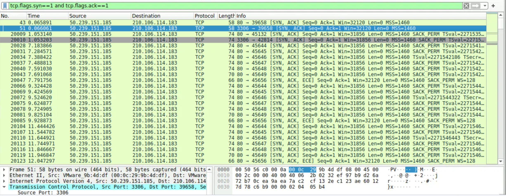
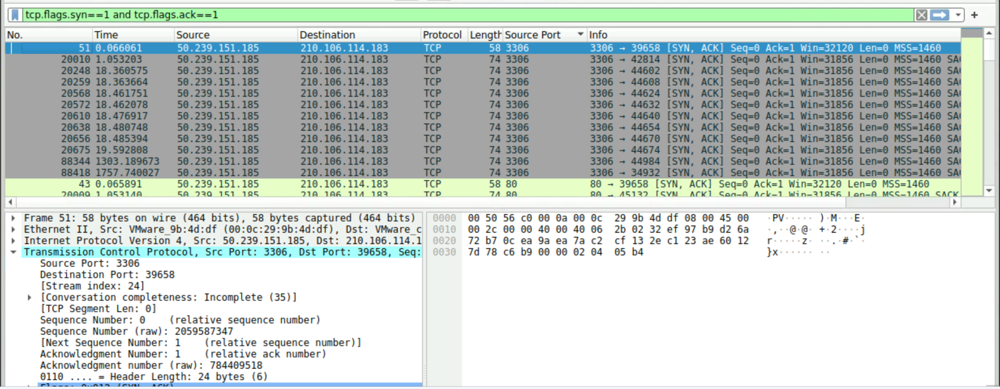
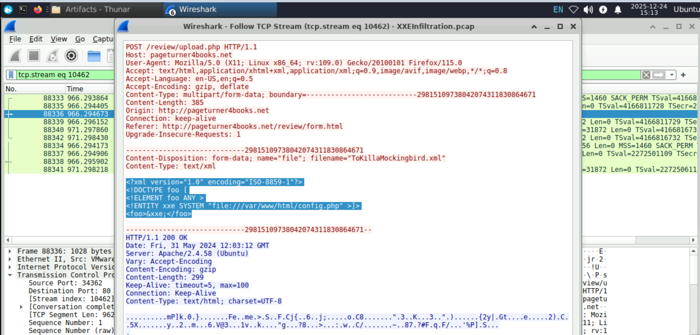

                                        XXE INFILTRATION LAB

**I.Scenario**
- An automated alert has detected unusual XML data being processed by the server, which suggests a potential XXE (XML External Entity) Injection attack. This raises concerns about the integrity of the company's customer data and internal systems, prompting an immediate investigation.
- Analyze the provided PCAP file using the network analysis tools available to you. Your goal is to identify how the attacker gained access and what actions they took.

**II.Questions**

1.Identifying the open ports discovered by an attacker helps us understand which services are exposed and potentially vulnerable. Can you identify the highest-numbered port that is open on the victim's web server?
- Firstly, Review the network traffic to locate potential port scanning activity. Focus on packets with a SYN flag, which may indicate a port scan attempt.
- Use the filter tcp.flags.syn == 1 && tcp.flags.ack == 1 in Wireshark to isolate the SYN-ACK packets, which indicate open ports discovered through a SYN scan.
                        

- Once you’ve filtered the traffic for SYN-ACK packets, examine the source port column to identify the ports that responded to the scan. The highest-numbered port should be your answer. You can also right-click a TCP source port and apply it as a column to make this easier.
                        

- Looking at the image below, we can see that the highest number of gates is 3306.
                        

Answer:  **3306**
 
2.By identifying the vulnerable PHP script, security teams can directly address and mitigate the vulnerability. What's the complete URI of the PHP script vulnerable to XXE Injection?

- Filter the HTTP traffic by looking for POST requests. These are typically used to submit data that could contain malicious payloads.
- Then apply the filter http.request.method == "POST" in Wireshark to focus on POST requests. Look at the URI path to identify where the attacker is submitting the data.
                        

- The next,Check the POST request for the XML file upload. In the packet details, locate the URI path and identify the PHP script that’s processing the malicious XML payload.
                        

Answer: **/review/upload.php**

3.To construct the attack timeline and determine the initial point of compromise. What's the name of the first malicious XML file uploaded by the attacker?

- Examine the POST requests in the traffic for files being uploaded. Malicious XML files may be named to blend in or mislead.

- Focus on the first POST request that contains an XML file, particularly one with a potentially suspicious or crafted payload designed for XXE injection.

 
Answer: **TheGreatGatsby.xml**

4.Understanding which sensitive files were accessed helps evaluate the breach's potential impact. What's the name of the web app configuration file the attacker read?

- After identifying the malicious XML payload, look for any references to local files that may have been accessed by the attacker.

- Pay attention to the XML file’s DOCTYPE declaration, which may contain an external entity pointing to critical files such as configuration files or system files.
                        

- Looking at to the image above, the attacker references a configuration file in the XXE payload. This file often contains sensitive data, like database credentials, which the attacker could exploit.
 
Answer: **config.php**

5.To assess the scope of the breach, what is the password for the compromised database user?

- Investigate the configuration file that was accessed for database connection details. These often contain critical information like usernames and passwords.
                        

- Look at the content of the file identified in the previous question that was accessed by the attacker. It should contain the credentials needed to connect to the database.

 
Answer: **Winter2024**

6.Following the database user compromise. What is the timestamp of the attacker's initial connection to the MySQL server using the compromised credentials after the exposure?

- Search for MySQL login requests in the packet capture. The attacker likely used the compromised credentials to authenticate to the MySQL server.
- Apply the Wireshark filter mysql.login_request to isolate login requests. Review the packets for the first connection attempt using the stolen credentials.
                        

Answer: **2024-05-31 12:08**

7.To eliminate the threat and prevent further unauthorized access, can you identify the name of the web shell that the attacker uploaded for remote code execution and persistence?

- Look for any suspicious file uploads or POST requests with unusual file extensions that could indicate a web shell.
- Examine the HTTP POST request for an XML file with an external entity pointing to a remote resource. The attacker may have uploaded a web shell in this manner.
- The attacker uploaded a file named PrideandPrejudice.xml containing an XXE payload that pointed to a remote web shell hosted on an external server.
                        

Answer: **booking.php**