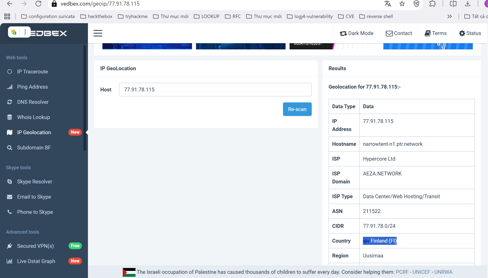
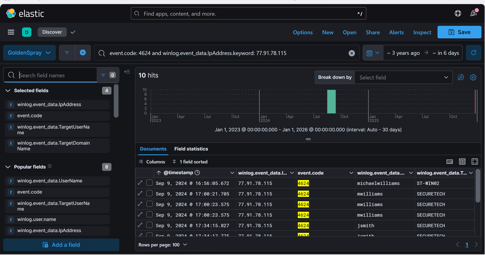
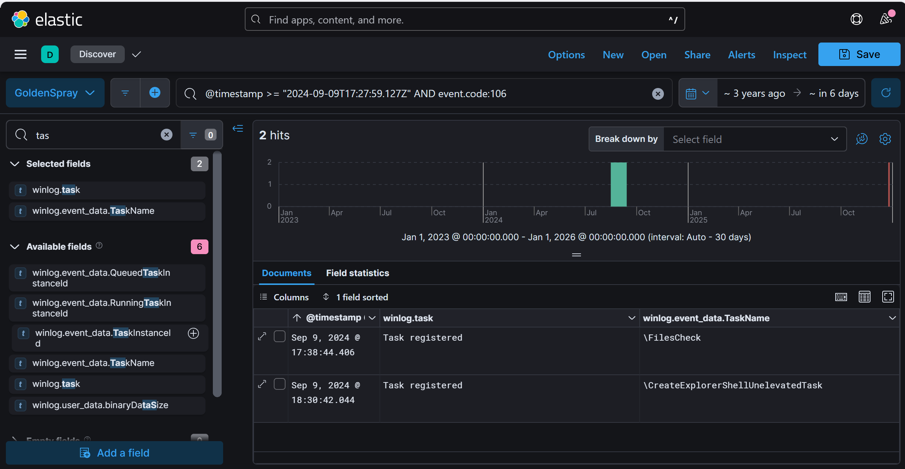
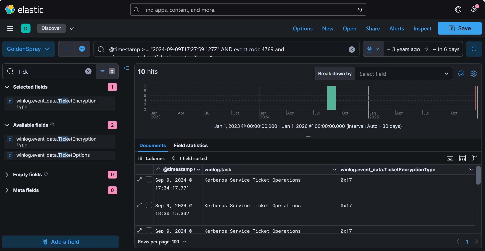

Reconstruct a multi-stage intrusion timeline by analyzing Windows and Sysmon event logs within Elastic SIEM to identify key attack tactics, techniques, and procedures.
**I. Scenario**
- As a cybersecurity analyst at SecureTech Industries, you've been alerted to unusual login attempts and unauthorized access within the company's network. Initial indicators suggest a potential brute-force attack on user accounts. Your mission is to analyze the provided log data to trace the attack's progression, determine the scope of the breach, and the attacker's **TTPs**.

**II. Introduction**
- In this lab walkthrough, we investigate a suspected brute-force attack and subsequent unauthorized access within the network of SecureTech Industries. The incident began with alerts about unusual login attempts, raising concerns about potential credential-based attacks targeting the organization’s Windows infrastructure. As a cybersecurity analyst, your role is to methodically analyze log data from Elastic SIEM, trace the attacker’s activities, identify compromised accounts, and uncover the techniques, tactics, and procedures (TTPs) employed throughout the attack lifecycle.
- The attack demonstrates a multi-stage intrusion, starting with brute-force attempts to gain initial access, followed by credential dumping using tools like Mimikatz, lateral movement through compromised accounts, and persistence mechanisms leveraging scheduled tasks. By dissecting key Windows event logs—such as Event ID **4625** for failed logins, Event ID **4624** for successful authentications, and Event ID **4769** for Kerberos ticket requests—you will uncover how the attacker infiltrated the network, maintained access, and escalated privileges.
- Throughout this walkthrough, we’ll leverage Elastic SIEM for threat hunting, focusing on detecting anomalies in login patterns, identifying malicious files and processes, and analyzing attacker behavior. We will cover key Windows security artifacts and explore common attack techniques, including the abuse of Kerberos tickets, PowerShell execution, and scheduled task creation for persistence. By the end of this guide, you will have a comprehensive understanding of how to investigate, detect, and mitigate similar attacks within an enterprise environment.

**III. Analysis**

**Question 1**. What's the attacker IP?
- In this scenario, as a cybersecurity analyst at SecureTech Industries, you've been alerted to a series of unusual login attempts and unauthorized access events within the company’s network. The nature of these alerts suggests a potential brute-force attack, a common tactic where an attacker systematically attempts numerous username and password combinations to gain unauthorized access to accounts. Understanding and mitigating such attacks require a methodical approach, starting with establishing a hypothesis based on the observed anomalies. In this case, the hypothesis is that the unusual login attempts stem from an external threat actor attempting to breach the network's security defenses.
- To begin the investigation, we utilize Elastic, focusing on specific event logs that capture failed login attempts. A key event to monitor in Windows Security Auditing is Event ID **4625**, which logs failed login attempts. This event is generated whenever there is an unsuccessful attempt to log into a system, making it an essential artifact in identifying brute-force attacks. Event ID **4625** contains critical fields such as the source IP address, the targeted username, and the timestamp of the attempt. Analyzing these fields allows us to identify patterns indicative of malicious activity.
- By querying the Elastic using event.code: **4625** alongside **event.provider.keyword: Microsoft-Windows-Security-Auditing**, we filter the logs to focus exclusively on failed login attempts recorded by Windows Security. This precise filtering helps narrow down the vast dataset, enabling us to close in on potential attack vectors.
    
- In the resulting data, we observe multiple failed login attempts targeting various user accounts such as admin1, Administrator, emilyjohnson, and backup. These attempts occurred within a narrow timeframe, suggesting an automated process typical of brute-force attacks rather than isolated user errors.
- A closer examination of the source IP addresses associated with these failed login attempts reveals a recurring external IP address: **77.91.78.115**. This IP address appears multiple times, consistently associated with failed attempts on different accounts. The concentration of activity from this IP address strongly indicates that it is the source of the brute-force attack. Additionally, the repeated targeting of administrative accounts, such as Administrator and admin, suggests that the attacker is attempting to gain privileged access, which could enable them to escalate their control within the network.
- To confirm these findings and gain a clearer overview, we utilize Kibana's visualization capabilities within Elastic. Visualizing the frequency of failed login attempts by source IP address provides an immediate indication of the most active sources. In this visualization, **77.91.78.115** stands out significantly, with 16 failed login attempts recorded, far exceeding any other IP addresses in the dataset.
 
- The prominence of this IP address, combined with the diversity of targeted user accounts and the rapid succession of attempts, provides compelling evidence that this is the attacker's IP.

Answer: **77.91.78.115**

**Question 2**: What country is the attack originating from?
Having identified the attacker’s IP address as **77.91.78.115** from the previous analysis, the next step is to determine the geographical origin of the attack. This is crucial for understanding potential threat actors and their operating regions, as well as for informing broader threat intelligence efforts. Identifying the geographical source can also assist in recognizing patterns of attacks originating from specific countries or regions, which may correlate with known threat groups or geopolitical motives.
- To perform this geolocation analysis, we can use an IP geolocation service. These services map IP addresses to specific geographical locations based on information from various databases, including internet registries, ISPs, and geolocation providers. One such tool is **IP2Location.io**, which provides precise geolocation data for IP addresses. By inputting the attacker's IP address into this service, detailed information about its origin can be retrieved.
        
    or 
        

- Upon entering **77.91.78.115** into the **IP2Location.io** tool, the service returns a JSON-formatted response with detailed location data. The key data point here is the country_name field, which specifies the country associated with the IP address. The response indicates that the IP address is registered in Finland.
 
- Additional information includes the region Uusimaa, district Helsinki, and specific city Helsinki, as well as the geographical coordinates and the ISP information AEZA International Ltd. While this level of detail can provide further context, for the purpose of this analysis, the country of origin is the most relevant data point.
- It is important to note that while IP geolocation can provide valuable insights, the results should be interpreted with caution. Attackers often use proxies, VPNs, or compromised systems to mask their true location, meaning the IP address may not represent the attacker’s actual geographical origin. However, this information still plays a critical role in identifying potential trends or recurring threats from specific regions.
        Answer: **Finland**

**Question 3**: What's the compromised account username used for initial access?
   - To identify the compromised account username used for initial access, we begin by analyzing successful login events from the previously identified attacker’s IP address, **77.91.78.115**. Successful logins in Windows Security Auditing are recorded under Event ID **4624**, which logs each time an account successfully authenticates to a system. By querying these events in Elastic, we can trace the login activity associated with the attacker's IP and pinpoint the account used for initial access.
        

   - The query event.code: **"4624"** and **winlog.event_data.IpAddress: 77.91.78.115**
   filters successful login attempts originating from the attacker's IP address. This search yields multiple login events targeting different user accounts. The timestamps of these logins indicate two distinct periods of activity.
   - The first successful login occurred using the account **michaelwilliams**. Upon examining system activity immediately following this login, no significant or suspicious behavior was detected, suggesting that this account may not have been fully compromised or used for further malicious actions.
        

 
   -  However, the second series of successful logins, which occurred shortly afterward, targeted the account **mwilliams**. Analyzing events in the timeframe following this login reveals numerous suspicious activities consistent with an attacker establishing and expanding their foothold within the network.
         

   - For instance, multiple Windows Sysmon events indicate the execution of suspicious scripts and tools, such as **PowerView.ps1**, **PsExec.exe**, and **mimikatz.exe**. These tools are commonly used in post-exploitation phases for tasks like privilege escalation, credential dumping, and lateral movement. The execution of **mimikatz.exe**, in particular, is a strong indicator of malicious intent, as this tool is often used to extract plaintext passwords and other authentication credentials from memory. Further analysis of the command-line arguments executed during this period provides additional evidence of malicious behavior. Commands were issued to modify registry keys, execute PowerShell scripts, and run other administrative tools, which are typical techniques used to maintain persistence, evade defenses, and escalate privileges.
         

   - The convergence of these activities following the login of the **mwilliams** account strongly suggests that this was the initial access point used by the attacker. The timeline of events, combined with the nature of the tools and commands executed after this login, clearly indicates that this account was leveraged by the attacker to gain a foothold in the network and carry out further malicious actions.

      Answer: **mwilliams**

**Question 4**:  What's the name of the malicious file utilized by the attacker for persistence on **ST-WIN02**?
- Persistence in cybersecurity refers to techniques that attackers use to maintain access to compromised systems even after reboots or logouts. One common method of achieving persistence is through modifying registry run keys, which are settings in the Windows Registry that automatically execute specified programs when the system starts.
- In the analysis of the system logs, we observed modifications to the registry run keys, specifically targeting the **HKLM\SOFTWARE\Microsoft\Windows\CurrentVersion\Run** key. This key is frequently abused by attackers to ensure their malicious software executes automatically upon system startup. By inserting a reference to a malicious executable into this registry key, the attacker can maintain persistent access to the system.
- Querying Elastic with parameters targeting Sysmon Event ID **11** (which logs file creation events) and focusing on the host **ST-WIN02**, we identify a suspicious file path: **C:\Windows\Temp\OfficeUpdater.exe**.
          

- This file was created and linked to suspicious registry activity, where a new entry was added to the Run key to execute **OfficeUpdater.exe**. The event data shows that this file was executed under the user context of **SECURETECH\mwilliams**, confirming that it was used during the attacker’s session.
 
- The expanded event details indicate that the file **OfficeUpdater.exe** was created by PowerShell, which is not a normal thing to see. The use of a seemingly benign name like **OfficeUpdater.exe** is a common tactic to avoid suspicion, blending into legitimate system processes and updates. However, its placement in the Temp directory and association with unauthorized registry changes clearly point to its malicious intent.
        Answer: **OfficeUpdater.exe**

**Question 5:** What's the full path used by the attacker for storing his tools?
- To determine the full path used by the attacker for storing their tools, we need to analyze the file creation events in the system logs, particularly focusing on the directories where suspicious tools were written. Attackers often organize their tools in a specific directory to streamline their operations during an intrusion. By identifying this directory, we can gain insight into the attacker's methods and ensure that all malicious artifacts are removed during remediation.
- Reviewing Sysmon Event ID **11** logs, which track file creation events, we observe multiple references to well-known hacking tools. These include **PowerView.ps1**, **PsExec.exe**, and **mimikatz.exe** which are commonly used for various post-exploitation activities such as enumeration, lateral movement, and credential dumping. Additionally, we notice a ZIP archive, **Backup_Tools.zip**, which likely contains a collection of these malicious utilities.
                        

- A key observation is that all these files are located within the same directory: **C:\Users\Public\Backup_Tools\\** . This directory was consistently used to store the attacker's tools, indicating a deliberate attempt to centralize their malicious files. The Public folder in Windows is often targeted by attackers because it provides broad accessibility across user accounts and may not be as tightly monitored as other directories.
- The specific files stored in this directory include:
 •	**PowerView.ps1**: A PowerShell script used for Active Directory reconnaissance.
 •	**PsExec.exe**: A tool from Sysinternals used for remote command execution.
 •	**mimikatz.exe**: A powerful post-exploitation tool used to extract plaintext passwords and other credential information from system memory.
 •	**Backup_Tools.zip**: A compressed archive that likely contains additional malicious tools or scripts.
- The creation of these files within **C:\Users\Public\Backup_Tools\/** indicates that this was the primary directory used by the attacker to manage and execute their malicious activities. By targeting this directory, the attacker ensured easy access to their tools across different user sessions, and possibly attempted to evade detection by using a seemingly benign directory name like **Backup_Tools**.
        Answer: **C:\Users\Public\Backup_Tools\\**

**Question 6**:  What's the process ID of the tool responsible for dumping credentials on **ST-WIN02**?
- To identify the process ID of the tool responsible for dumping credentials on **ST-WIN02**, we must understand how credential dumping tools like Mimikatz operate and their interaction with key system processes, specifically **lsass.exe**. Mimikatz is a widely used post-exploitation tool designed to extract plaintext passwords, hashes, PINs, and Kerberos tickets from memory. It achieves this by interacting with the **Local Security Authority Subsystem Service** (LSASS), which stores sensitive security information, including user credentials. By accessing **lsass.exe**, Mimikatz can extract this information and provide attackers with critical credentials for further exploitation.
- To trace this activity in the logs, we begin by searching for execution events associated with **mimikatz.exe**. This is achieved using Sysmon Event ID **1**, which records process creation events. By querying for processes named **mimikatz.exe**, we can identify when and where this tool was executed on **ST-WIN02**. The search results reveal three separate executions of Mimikatz, with corresponding Process IDs (PIDs) of **3708**, **528**, and **2900**.
                                

- Once we have identified these process IDs, the next step is to determine which of these instances interacted with **lsass.exe**. To achieve this, we query for **Sysmon Event ID 10**, which logs process access events. This event type is crucial for identifying when one process attempts to interact with or manipulate another. By filtering for events where the SourceProcessId matches one of the previously identified PIDs ( **3708** , **528**, or **2900**), we can pinpoint the specific interaction between Mimikatz and **lsass.exe**.
                                

- The event logs reveal that the process with PID **3708** accessed **lsass.exe**. The detailed event data confirms that **mimikatz.exe** was executed from the path **C:\Users\Public\Backup_Tools\mimikatz.exe** and targeted the **lsass.exe** process located at **C:\Windows\system32\lsass.exe**. This confirms that PID **3708** is the process responsible for dumping credentials on **ST-WIN02**.
                Answer: **3708**

**Question 7**:  What's the second account username the attacker compromised and used for lateral movement?
- To identify the second account username compromised by the attacker for lateral movement, we need to examine the sequence of events that followed the credential dumping activity. In our earlier analysis, we confirmed that the attacker used Mimikatz to extract credentials from the **Local Security Authority Subsystem Service (LSASS)** process on **ST-WIN02**. The process ID linked to this credential dump was **3708**, and it occurred at **17:27:59 on September 9, 2024**. With the exact timestamp of the credential dump established, our next step is to analyze successful login events Event ID **4624** that occurred after this time, specifically those originating from the attacker’s IP address **77.91.78.115**. Event ID **4624** in Windows Security Auditing logs records every instance of a successful login, capturing critical details such as the username, domain, source IP, and timestamp. By filtering these logs for events postdating the credential dump, we can trace the attacker’s lateral movement through the network.
Upon querying Elastic for Event ID **4624** events from **77.91.78.115** after **17:27:59**, we observe a series of successful logins associated with the user account **jsmith**.
                                

- These logins started at **17:34:15** and continued in quick succession, indicating sustained activity under this compromised account. The consistent use of **jsmith** in these events suggests that the attacker leveraged the credentials obtained from the earlier **Mimikatz** dump to authenticate into other systems within the **SECURETECH** domain.
- The **SECURETECH** domain, visible in the **winlog.event_data.TargetDomainName** field, indicates that the compromised **jsmith** account had domain-level access. This level of access is particularly concerning because domain accounts often have permissions that extend across multiple systems, enabling attackers to pivot within the network and escalate their privileges further.
- The attacker’s use of **jsmith** for lateral movement highlights a common attack pattern: initial access is gained through one compromised account (in this case, **mwilliams**), followed by credential dumping to harvest additional credentials. The attacker then uses these new credentials to move laterally, increasing their control over the network and potentially accessing more sensitive systems and data.
                        Answer: **jsmith**

**Question 8**:  Can you provide the scheduled task created by the attacker for persistence on the domain controller?
- To determine the scheduled task created by the attacker for persistence on the domain controller, we focus on analyzing Event ID **106**, which logs task creation activities in the Windows Task Scheduler. Task Scheduler is a legitimate administrative tool in Windows that allows users and administrators to schedule scripts or programs to run at specific times or under certain conditions. However, attackers often abuse this functionality to establish persistence, ensuring that their malicious code executes automatically, even after reboots or user logouts.
- Using Elastic, we query for Event ID **106** with a timestamp filter starting after **17:27:59 on September 9, 2024**, which aligns with the timeline following the credential dumping activity. This query reveals two task creation events, but the task of interest here is named **FilesCheck**, which was registered at **17:38:44**. This task stands out due to its proximity to other malicious activities and its suspicious naming convention, which is designed to appear benign while masking its true purpose.
                                

- To investigate further, we search for additional logs related to FilesCheck and analyze the command used to create this task. The expanded event details show that the attacker utilized the schtasks command-line utility to configure this task.

- The specific command executed is:
**schtasks /create /tn "FilesCheck" /tr "powershell.exe -ExecutionPolicy Bypass -File C:\Windows\Temp\FileCleaner.exe" /sc hourly /ru SYSTEM**
- Breaking down this command:
      • **schtasks /create**: This initiates the creation of a new scheduled task.
      • **/tn "FilesCheck"**: Assigns the task the name **FilesCheck**, likely an attempt to disguise its malicious intent by making it look like a routine system check.
      • **/tr "powershell.exe -ExecutionPolicy Bypass -File C:\Windows\Temp\FileCleaner.exe"**: Specifies the action to be performed by the task. Here, PowerShell is invoked with the ExecutionPolicy set to Bypass, allowing the script to run without restrictions. The script or executable being run is **FileCleaner.exe**, located in the Temp directory, a common location for storing transient or malicious files.
      •  **/sc hourly**: Configures the task to run  every hour, ensuring frequent execution and sustained persistence.
      •  **/ru SYSTEM**: Specifies that the task runs with SYSTEM privileges, granting it the highest level of access on the machine.
- The use of PowerShell with bypassed execution policies and the placement of the executable in a temporary directory are clear indicators of malicious intent. Running this task with SYSTEM privileges ensures that the attacker retains control over the domain controller, allowing them to execute arbitrary code with elevated permissions.
                        Answer: **FilesCheck**

**Question 9**:  What's the encryption type used in the environment Kerberos tickets?
- To determine the encryption type used for Kerberos tickets in the environment, we begin by understanding the role of Kerberos in network authentication and the importance of encryption in securing this process. Kerberos is a widely-used authentication protocol designed to provide secure, mutual authentication between users and services within a network. It relies on tickets and symmetric key cryptography to ensure that credentials are never directly transmitted over the network, reducing the risk of credential theft through interception.
- In the Kerberos authentication process, **Ticket Granting Tickets (TGTs)** and Service Tickets are issued to authenticate users and services. These tickets are encrypted using specific encryption algorithms, referred to as encryption types, which are critical to the security of the authentication process. Different encryption types provide varying levels of security, with modern environments favoring stronger algorithms like **AES256-CTS-HMAC-SHA1-96**. However, older or misconfigured environments might still use weaker algorithms such as **RC4-HMAC**, which are vulnerable to attacks like Kerberoasting—a technique used by attackers to extract service account hashes from Kerberos tickets and crack them offline.
- To identify the encryption type used in the environment, we query Event ID **4769** in Elastic. Event ID **4769** logs the issuance of service tickets by the **Key Distribution Center (KDC)**, including the encryption type used for each ticket. This event contains a field called **winlog.event_data.TicketEncryptionType**, which specifies the encryption algorithm in hexadecimal format. Upon querying Event ID **4769**, we observe multiple entries where the **TicketEncryptionType** is listed as **0x17**.
                        

- To interpret this value, we refer to Microsoft's official documentation on Kerberos ticket encryption types. According to the documentation, **0x17** corresponds to **RC4-HMAC**, which is the default encryption suite for operating systems prior to Windows Server 2008 and Windows Vista.
                        

- **RC4-HMAC** is a stream cipher that, while historically popular, is now considered insecure due to known vulnerabilities. It is susceptible to cryptographic attacks that can compromise the integrity of encrypted data. The continued use of **RC4-HMAC** in a modern environment presents significant security risks, as attackers can exploit these weaknesses to perform credential-based attacks such as pass-the-ticket or Kerberoasting.
                        Answer: **RC4-HMAC**

**Question 10**: Can you provide the full path of the output file in preparation for data exfiltration?
- To determine the full path of the output file in preparation for data exfiltration, we begin by analyzing Sysmon Event ID **11**, which logs file creation events. Since we have previously observed the use of PowerShell and its execution of scripts like **PowerView.ps1**, it is reasonable to assume that PowerShell might have been used to generate and manipulate files intended for exfiltration. Filtering Sysmon Event ID **11** for processes associated with powershell.exe, we identify a suspicious ZIP archive created at ****17:53:10 on September 9, 2024**. The file path of this archive is **C:\Users\Public\Documents\Archive_8673812.zip**, which is stored in a publicly accessible location.
                        

- Attackers often use directories such as **Public** and **Temp** to ensure that files can be easily accessed and transferred without raising immediate suspicion. To validate this file’s creation, we analyze the logs around the same timestamp and identify a PowerShell process (**PID: 4460**) executing a command that includes Add-Type, which is used to load external **.NET** assemblies. The specific assembly loaded is **System.IO.Compression**, which is commonly used to compress files into ZIP archives. The execution sequence confirms that PowerShell was used to compress data into the **Archive_8673812.zip** file.
 
- By tracing the context of the PowerShell execution, we see that it was executed with a **-NoExit** flag, which allows the session to persist after running the script. The command also includes a **Set-Location** instruction targeting C:\Shares, which suggests that the attacker may have staged files in this directory before archiving them. The combined evidence indicates that the **Archive_8673812.zip** file was likely prepared for exfiltration, possibly through an external upload mechanism such as FTP, SMB, or cloud storage. Attackers often create ZIP files to bundle multiple sensitive files together, reducing the number of outbound transfers needed and minimizing detection risks. In conclusion, the full path of the output file prepared for data exfiltration is **C:\Users\Public\Documents\Archive_8673812.zip**. This file was created using PowerShell, leveraging the **System.IO.Compression** module, indicating an attempt to bundle data before extraction.
                        Answer: **C:\Users\Public\Documents\Archive_8673812.zip**

