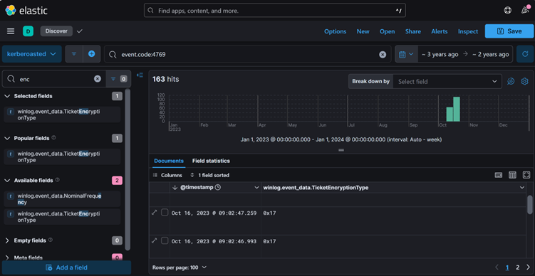
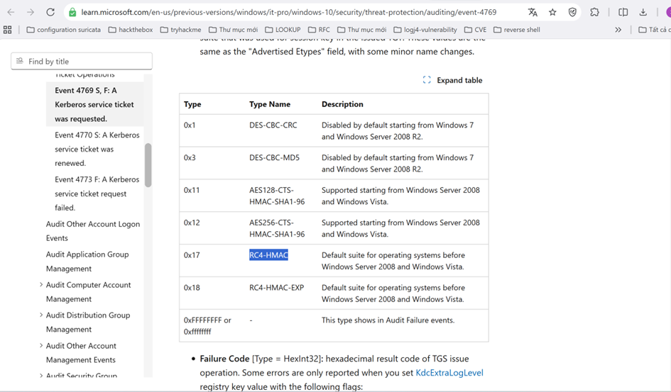
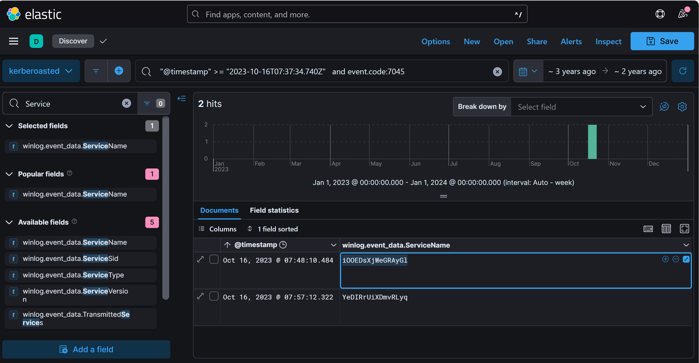
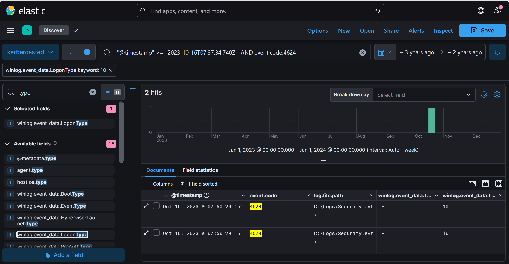
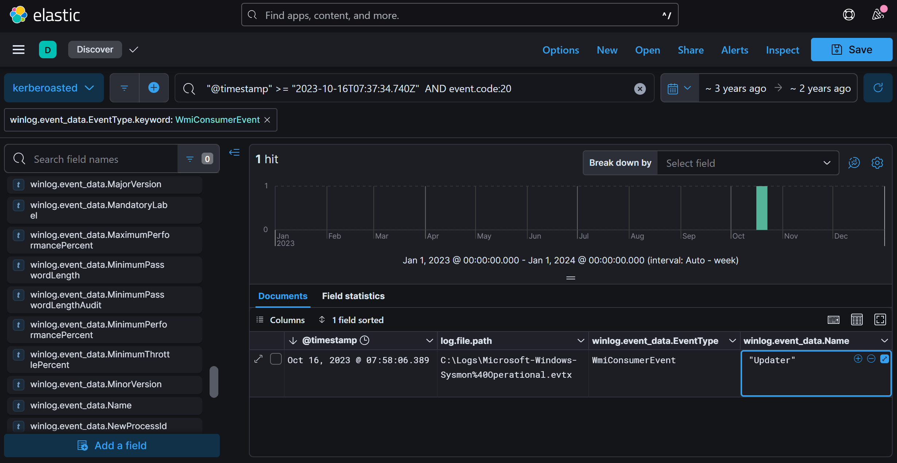

**I. Scenario**
- As a diligent cyber threat hunter, your investigation begins with a hypothesis: 'Recent trends suggest an upsurge in Kerberoasting attacks within the industry. Could your organization be a potential target for this **attack technique**?' This hypothesis lays the foundation for your comprehensive investigation, starting with an in-depth analysis of the domain controller logs to detect and mitigate any potential threats to the security landscape.
**Note**: **Your Domain Controller** is configured to audit Kerberos Service Ticket Operations, which is necessary to investigate kerberoasting attacks. Additionally, **Sysmon** is installed for enhanced monitoring.

**Q1: To mitigate Kerberoasting attacks effectively, we need to strengthen the encryption Kerberos protocol uses. What encryption type is currently in use within the network?**
-	Review logs for service ticket requests, focusing on entries mentioning encryption types. Have you checked any event IDs that could help detect a Kerberoasting attack?
-	**Event ID 4769** logs information about **Kerberos Service Ticket Requests**, including the encryption type used. This event is important to analyze the strength of encryption used in **Kerberos tickets**.
-	In your query, filter **Event ID 4769** and examine the **TicketEncryptionType** field to identify any weak encryption types.
        
- In the image above, we see that the value of the **winlog.event_data.TicketEncryptionType** field is **0x17**. Next look for anything related to code **0x17**:    
           

    Answer: **RC4-HMAC (0x17)**

**Q2: What is the username of the account that sequentially requested Ticket Granting Service (TGS) for two distinct application services within a short timeframe?**
-	Look for repeated **Ticket Granting Service (TGS) requests** from a single user over a brief period. Focus on **Event ID 4769**.
-	Within your query, examine **Event ID 4769** for repeated **TGS requests**, paying attention to TargetUserName and ServiceName to detect patterns of sequential service access.
 
    Answer: **johndoe**

**Q3: We must delve deeper into the logs to pinpoint any compromised service accounts for a comprehensive investigation into potential successful kerberoasting attack attempts. Can you provide the account name of the compromised service account?**
-	Look for **TGS requests** to service accounts by examining **Event ID 4769** in your query. Service accounts associated with administrative privileges or high-value services are typically high-risk.
        

    Answer: **SQLService**

**Q4: To track the attacker's entry point, we need to identify the machine initially compromised by the attacker. What is the machine's IP address?**
-	Look for successful logons associated with the user suspected of Kerberoasting activity from your previous analysis.
-	**Event ID 4624** logs successful logons and includes the SourceIPAddress, which can help identify the originating IP.
           

    Answer: **10.0.0.154**

**Q5: To understand the attacker's actions following the login with the compromised service account, can you specify the service name installed on the Domain Controller (DC)?**
-	Service installations are logged and can reveal post-compromise activities on the DC. Have you reviewed the corresponding event ID?
-	**Event ID 7045** provides details about the service name, installation path, and the account responsible for the installation.
Query: **"@timestamp" >= "2023-10-16T07:37:34.740Z" and event.code:7045**
            
    Answer: **iOOEDsXjWeGRAyGl**

**Q6: To grasp the extent of the attacker's intentions, What's the complete registry key path where the attacker modified the value to enable Remote Desktop Protocol (RDP)?**
-	Enabling **RDP** typically modifies registry keys. Have you checked the event ID associated with registry key changes?
-	Look for entries with **Event ID 13**, focusing on registry changes linked to RDP configurations.
-	**Event ID 13** in Windows logs provides details on modified registry paths. Focus on registry keys associated with **Remote Desktop Protocol (RDP)** settings, especially within the **HKLM\SYSTEM\CurrentControlSet\Control\Terminal** Server path.

-	Query : **"@timestamp" >= "2023-10-16T07:37:34.740Z" and event.code: "13"**
            

       Answer: **HKLM\System\CurrentControlSet\Control\Terminal Server\fDenyTSConnections**

**Q7: To create a comprehensive timeline of the attack, what is the UTC timestamp of the first recorded Remote Desktop Protocol (RDP) login event?**
  -	**Remote Desktop Protocol (RDP)** logins utilize a specific logon type, which is recorded under a particular event ID. Have you reviewed these logs?
  -	Use **Event ID 4624** with **Logon Type 10** in your query to pinpoint the initial **RDP** login. Focus on the time and TargetUserName for a complete view.
         

         Answer: **2023-10-16 07:50**

**Q8: To unravel the persistence mechanism employed by the attacker, what is the name of the WMI event consumer responsible for maintaining persistence?**
  -	**Windows Management Instrumentation (WMI)** event consumers are often leveraged by attackers for persistence. Have you reviewed the event ID associated with WMI activity?
  -	**Sysmon Event ID** **20** logs the creation of **WMI event consumers**, a common persistence tactic. Include this in your query, as WMI consumers may trigger actions or scripts that help malware or applications maintain a foothold on the system.
  Query : **"@timestamp" >= "2023-10-16T07:37:34.740Z" AND event.code:20**
            
        Answer:**Updater**

**Q9: Which class does the WMI event subscription filter target in the WMI Event Subscription you've identified?**
  -	**WMI** event filters target specific classes and activate actions when certain conditions are met. Have you reviewed the relevant event ID for this?
  -	**Sysmon Event ID 19** records details on WMI filters, including potentially targeted WMI classes. Consider using this in your query for more insights.
        

      Answer: **Win32_NTLogEvent**
